---
tagColors:
  default: 0288D1
  无坐标: 4A148C
  晚上巡礼: 3949AB
  まに漫画: 7CB342
  柚原もけ漫画: 7CB342
  动画: F57C00
  小说: 0288D1
  已拆除: 757575
  已歇业: 757575
mapCenter: 35.434435,136.728202,13
rasterImages:
  - name: malera-gifu-1
    url: /img/malera-gifu-1.webp
    opacity: 0.8
    coordinates:
      - - 136.67071192626491
        - 35.45225962945115
      - - 136.67174498765905
        - 35.457247853258735
      - - 136.67467687876712
        - 35.45680898147391
      - - 136.67364827680746
        - 35.45184414590692
  - name: malera-gifu-2
    url: /img/malera-gifu-2.webp
    opacity: 0.8
    coordinates:
      - - 136.67071192626491
        - 35.45225962945115
      - - 136.67174498765905
        - 35.457247853258735
      - - 136.67467687876712
        - 35.45680898147391
      - - 136.67364827680746
        - 35.45184414590692
  - name: gifu-1
    url: /img/gifu-1.webp
    opacity: 0.8
    coordinates:
      - - 136.75644256371237
        - 35.40977807297594
      - - 136.75823226031753
        - 35.409591309966046
      - - 136.7581559464379
        - 35.40909572200667
      - - 136.7563712508997
        - 35.40928350669378
---

# 安达与岛村 圣地巡礼指南

**文档基于みね的「[安達としまむら聖地巡礼 Vol.1](https://mine-toootoi.hateblo.jp/entry/2021/11/19/205325)」制作而成**

仅仅是为了方便圣地巡礼而将其转为了更方便检索的形式，顺带将原文、动画漫画截图也标注了上去。（为方便统一，小说原文取自台版文本，柚原もけ漫画截图自B漫）

所有地点的编号均和原册一致，请务必搭配原册使用。原册上除了巡礼地点外还有对约会路线、具体食物的考据。

> 除此以外也补充了其他人的考据地点：[推特@はにすけ](https://twitter.com/_hanisuke/status/1719989401806336457)、[入间人间 Wiki](https://irumahitoma.fandom.com/zh/wiki/入间人间Wiki)、[微博@甘井文](https://weibo.com/u/7651616302)。补充地点没有编号，并且会在对应条目写明来源。没写的就是我自己的考据~~或是忘了~~。

> 实地照片除自摄和谷歌街景外，来自于：[入间人间 Wiki](https://irumahitoma.fandom.com/zh/wiki/入间人间Wiki)、[bilibili@盐酸葡萄](https://space.bilibili.com/8811426)。也欢迎更多好心人提供更好看更符合对应场景的照片。

> 本文档以 Markdown 格式存放在 [GitHub](https://github.com/hymbz/MarkdownMap/tree/安達としまむら) 上，如发现文档错漏需要修正，欢迎通过 GitHub 或其他渠道反馈。
>
> 除本在线地图外，也有[谷歌地图版](https://www.google.com/maps/d/viewer?mid=1udLjhc4YtAU4ok9qGMFaG-m6g12aBb8)可供查阅。

## モレラ岐阜 周辺

### 1. 本巣市立土貴野小学校

樽见和岛村的小学母校的原型，岛村妹也正在这里上学。

在小说第四卷第二章「春與月」中，樽见与岛村一起出去玩时在这个校门口集合。之后她们前往了「[31. 鉄板厨房天てん 北方店](#31-鉄板厨房天てん-北方店)」

> > 這一天，我站在約定的地點，也就是**小學**的校門口。雖然很好奇竟然不是約在車站前面，不過樽見好像有想好要去哪裡，於是我就把整件事都交給她決定了。

> 
> 
> 
> 

<!-- 柚原もけ漫画 第19话P21 里出现的小学校门材质看着更像是水泥，和这里实在是不像 -->

#动画

#35.451401, 136.654386

[Google Map](https://maps.app.goo.gl/DxGuztihbNcExqiF9)

### 2.1 古墳公園通り

动画第1话中俩人一起去往岛村家的路上经过的小桥。

> 
> 

※ 这里是住宅区，注意音量与举止

#动画

#35.44972, 136.66652

#### 2.2 电线杆

> 
> 
>
> > 配图拍的其实是 (35.44990, 136.66687) 处的电线杆，这根在外观上会更像点，但和动画中的左右位置刚好相反

#动画

#35.44974, 136.66671

#### 2.3 岛村模仿飞机的地方

> 

> > 心裡這股小小的興奮，賜給了我一雙翅膀。
> >
> > 「模仿飛機，咻～」
> >
> > 我試著將雙手往水平方向伸直，行走一小段路。
> >
> > 距離開始對此感到難為情，還需要幾步呢？
>
> 小说第一卷「制服PINPON」

#动画

#35.45012, 136.66685

#### 2.4 推荐的拍摄点

「[2.1 古墳公園通り](#21-古墳公園通り)」的照片要在这里拍

#35.44928, 136.66657

### 3. 見延公園

小说第二卷「白色相簿」中，岛村送给安达回旋镖当圣诞礼物后，在这里教安达如何正确的投掷。

> > 在購物中心前方那條道路對面、旁邊有汽車駕訓班的**公園**裡，除了我們以外沒有其他人在。放寒假的小朋友們應該都待在家裡打電動吧。生鏽的遊樂器材暴露在冬天的寒風中，上頭快要剝落的塗料一角因而製造出受到寒風吹拂的聲響。

> 
> 

其中提到的汽車駕訓班就是「[4. 北方自動車学校](#4-北方自動車学校)」

<!-- 柚原もけ漫画 第12话里，安达扔回旋镖的地方看着更像是「1F ORANGE PLAZA 东入口」旁边的绿地 —— 就在出入口附近，有两排行道树。不过现实里好像没有那种样式的长椅。 -->

#小说 #动画 #晚上巡礼

#35.45776, 136.67126

[Google Map](https://maps.app.goo.gl/JypLF7GwzkEyvEYg7)

### 4. 北方自動車学校

小说第四卷第三章「月與決心」中，安达骑车到购物中心「[6. モレラ岐阜](#6-モレラ岐阜)」时经过的驾校。

> > 我經過**汽車駕訓班**前面，穿過西裝店的停車場，最後來到曾和島村來過幾次的購物中心。我也沒其他地方可以消磨時間，來這裡或許正好。

#小说

#35.45839, 136.67318

[Google Map](https://maps.app.goo.gl/8ycMQjJtSWqHn4B29)

### 5. 洋服の青山 本巣店

小说第四卷第三章「月與決心」中，安达骑车到购物中心「[6. モレラ岐阜](#6-モレラ岐阜)」时经过的西裝店。

> > 我經過汽車駕訓班前面，穿過**西裝店**的停車場，最後來到曾和島村來過幾次的購物中心。我也沒其他地方可以消磨時間，來這裡或許正好。

#小说

#35.4551244, 136.6760418

[Google Map](https://maps.app.goo.gl/xvyRYsbb8QbJ4ssL9)

### 6. モレラ岐阜

书中出现了超多次的购物中心，说是安达与岛村的主题公园也不为过。

> 小说
> - 第一卷「等邊TRIANGLE」中，安达与岛村第一次一起在周末来这里玩结果遇到了社妹
> - 第二卷「白色相簿」中，安达与岛村第一次圣诞约会的地点
> - 第三卷第一章中，安达特意带岛村到这里看情人节海报并提出要送巧克力的地方
> - 第三卷第三章中，岛村带妹妹和社妹来这里看电影
> - 第四卷第三章中，安达在这里的宠物店偶遇樽见和占卜师
> - 第五卷第三话中，安达在岛村之刃后在这里和岛村和好
> - 第九卷第四章中，安达与岛村第二次圣诞约会的地点

其中更多更具体的巡礼点请见「モレラ岐阜」分组。

※ 设施内禁止拍摄，如有需要请联系相关人员获取许可

地图：<https://malera-gifu.com/floorguide/>

#小说 #动画 #柚原もけ漫画

#35.4550929, 136.6729569

[Google Map](https://maps.app.goo.gl/Ubic8mSXFPFA8K1r8)

### 7. 鞍掛神社

动画第3话中社妹首次露脸的神社。

> 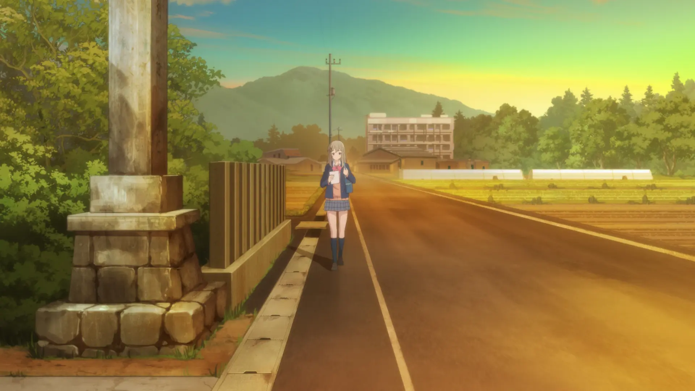
> 
> 
> 
> 

> 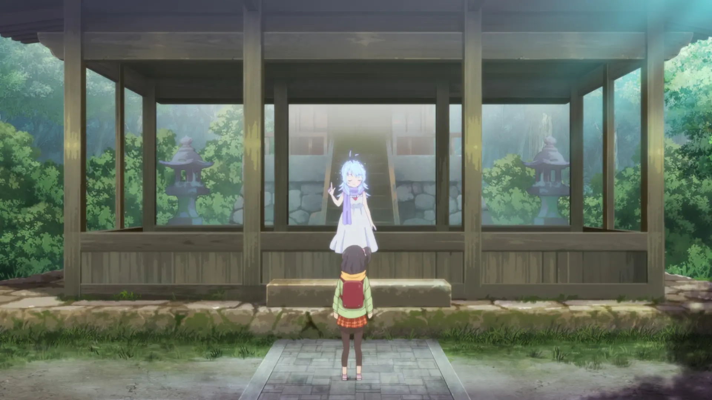
> 

神社供奉着素盏鸣命（スサノオノミコト），据说有消除厄运、结缘和招财进宝的功效。

#动画

#35.4542994, 136.6796374

[Google Map](https://maps.app.goo.gl/gKoZenpmt2jNCrVq7)

### 8. 眼鏡市場 岐阜本巣店

小说第三卷「制服PINPON」中，岛村在放学后找安达时路过的眼镜行。

> > 本來在猶豫要不要去加油站旁邊的便利商店看看，不過最後還是打消念頭，橫越**眼鏡行**那座沒停半輛客人車子的停車場。

> 

#小说

#35.4514293, 136.6748824

[Google Map](https://maps.app.goo.gl/GCjieAjp8KbRfpsV6)

### 9.1 岐阜第一高等学校

动画中的学校原型。

原本是男子学校，但现在已经变成了混合学校。

> 

#动画

#35.443312, 136.674892

[Google Map](https://maps.app.goo.gl/cuMnHtHhU1j3ZoSH9)

#### 校门

> 
> 
> 
> 

#动画

#35.443354, 136.6737719

#### 9.2 河边道路

动画第4话中，安达骑自行车去卡拉OK时经过的河边道路。

> 
> 

#动画

#35.4444602, 136.6756214

#### 9.3 河堤

动画第4话中，安达骑自行车去卡拉OK时经过的河堤。

> 
> 

> 这边有好几个排水口注意不要认错，特征是排水口附近有区别于别处的白色石砖。
>
> 另外注意拍照要到对岸去拍。

#动画

#35.44215, 136.67656

#### 体育馆

> 
> 

> 

[by 推特@はにすけ](https://twitter.com/_hanisuke/status/1720388852450525219)

#动画

#35.442819720834436, 136.6750116392165

#### 体育馆外楼梯

> 

> 

（小说中有「聽到有兩個很有精神的說話聲與腳步聲進入體育館，而且朝二樓前來。」的描写，应该都是从体育馆内的楼梯上的二楼。动画也是如此。只有柚原もけ漫画里是通过外面的楼梯上下二楼，应该是参考了现实这里画的）

[by 推特@はにすけ](https://twitter.com/_hanisuke/status/1720388856388993051)

#柚原もけ漫画

#35.442593797206875, 136.67523238883018

#### 喷泉

动画第8话中，安达吃午餐的地方。

> 
> 

> 

（这个应该是喷泉吧，mapbox 地图上显示这里有水，形状也挺像的，也符合动画的位置）

#动画

#35.44314559698006, 136.67514790729274

### 10.1 リカーマウンテン 北方店

动画第9话安达与岛村在放学后去名古屋路上经过的地方。

#动画

#35.4414697, 136.6740444

[Google Map](https://maps.app.goo.gl/SjA5Pfb6vaJbEZ1n7)

#### 10.2 红绿灯

> 
> 

#动画

#35.4416106, 136.6744097

#### 10.3 停车场

> 
> 

#动画

#35.4413145, 136.6742313

### 11. ファミリーマート本巣上真桑店

原作第一卷「制服PINPON」中，安达经常坐的栏杆旁边的便利商店。

> > 本來在猶豫要不要去加油站旁邊的**便利商店**看看，不過最後還是打消念頭，橫越眼鏡行那座沒停半輛客人車子的停車場。

> 

> 
>
> 右边为安达常坐的栏杆，左边是便利商店

#小说 #まに漫画

#35.4366761, 136.6759944

[Google Map](https://maps.app.goo.gl/GUCpaw79awCuxETYA)

#### 11.1 安达常坐的栏杆

原作第一卷「制服PINPON」中，安达经常坐的栏杆。

> > 安達或許坐在經過加油站之後的那個地方，我稍微抱持這種期待，腳步在途中加快，卻沒看見那個沒教養的不良少女，只看見靜靜設置在那裡的**護欄**。我踩上護欄試著坐上去，卻差點摔到車道上。

> 
> 

动画则是改为了东京的「[4. ベンチ](#4-ベンチ)」

#小说 #まに漫画

#35.4366163, 136.6763529

### 12. 出光 セルフ北方 SS（岐西興産）

原作第一卷「制服PINPON」中，安达经常坐的栏杆旁边的加油站。

> > 安達或許坐在經過**加油站**之後的那個地方，我稍微抱持這種期待，腳步在途中加快，卻沒看見那個沒教養的不良少女，只看見靜靜設置在那裡的護欄。

> 

#35.4360422, 136.6765447

[Google Map](https://maps.app.goo.gl/m6mQwBBPHUtUNp6k9)

### 13.1 高橋米穀店

动画中「永藤肉店」的原型。

> 
> 
> 

> 

#小说 #动画 #柚原もけ漫画

#35.4401219, 136.6887772

[Google Map](https://maps.app.goo.gl/rXhqj8a28h9hak937)

<!-- 13.2 就是 「14.1 ファミリーマート 北方加茂店」，因为在册子中重复出现所以这里省略了 -->

#### 13.3 旁边的店铺

动画第11话中，岛村偶遇妹妹和社妹时的背景。

> 
> 

#动画

#35.4401588, 136.6894424

[Google Map](https://maps.app.goo.gl/bAtG6ZVLKZr2G22QA)

### 14.1 ファミリーマート 北方加茂店

动画第11话中，岛村偶遇妹妹和社妹在这里吃蛋糕。

> 
> 

> 不过在原作小说第四卷附錄「社妹來訪者６」剧情中，实际岛村并没有出场。

> 动画里吃的是草莓蛋糕（えちごしょーと），小说中吃的则是「形狀類似草莓蛋糕的千層蛋糕」（ミルクレープ）

#动画

#35.4404861, 136.6895957

[Google Map](https://maps.app.goo.gl/WKLZSYtynhZk7jj69)

#### 14.2 电线杆

动画第11话中，岛村与社妹对话的电线杆。

> 
> 

#动画

#35.4403194, 136.6897419

### 15. 岐阜県立 岐阜農林高等学校

小说第八卷「第一次旅行的一角①」中，岛村在修学旅行中提到的农业高中。

> 

> > 原來也有學校的教育旅行時間跟地點跟我們一樣啊──我如此心想，目送穿著綠色制服的人群離開。我們那裡的**農業高中**制服也是綠色的，不過他們的顏色比農業高中的還要更暗一點。

（不过不知道是不是制服有过改版，现在不管是网上查的还是巡礼时遇到的学生，其制服颜色都已经暗到了接近黑色的地步，很难想象这种颜色更暗后还能叫做绿色）

#小说

#35.4376256, 136.696662

[Google Map](https://maps.app.goo.gl/sV9VPajNZBhBqAEo8)

### 16. アピタ 北方店

小说第八卷「第一次旅行的一角①」中，安达与岛村在谈论旧金山旅行时提到的购物中心。

> > 可是舊金有近到可以說去就去嗎？她是當作去MALera嗎？還是當作去**APiTA**？

> 

#小说

#35.4326004, 136.6814486

[Google Map](https://maps.app.goo.gl/8RAhnYynqEttPKUw9)

### 17. 平成公園

小说第二卷「島村思考中聖誕節進行中」中，岛村与永藤买完回旋镖后试玩的地方。

> > 我們離開停車場，前往位於附近牛丼店後方的**噴水廣場**。
>
> > 雖然廣場上有個三條銀色的線不斷轉來轉去的謎樣物體，不過這裡的樹很少，所以應該還滿適合丟迴力鏢的吧。

> 
> 

※ 夏天才有喷泉

#小说

#35.4307361, 136.6832274

[Google Map](https://maps.app.goo.gl/svDTWBGWos4sh1ay6)

### 18. すき家 岐阜北方店

小说第二卷「島村思考中聖誕節進行中」中，岛村与永藤买完回旋镖后提到的牛丼店。

> 我們離開停車場，前往位於附近**牛丼店**後方的噴水廣場。

> 

#小说

#35.4302688, 136.6835954

[Google Map](https://maps.app.goo.gl/gDAaHJSPt5r1SxMy5)

## モレラ岐阜

地图：<https://malera-gifu.com/floorguide/>

**注意！官网地图上的店铺编号是会变更的。**

みね的圣地巡礼册子中的编号已经落后于版本，本文档内的编号也无法保证及时更新，因此请不要直接用本文档上的店铺编号在官网地图或商场内的地图牌上找位置，版本可能对不上。

不过因为店铺位置不会变，所以可以使用本文档内置的地图来确认位置，点击即可显示：

- [显示一楼地图](#show:malera-gifu-1)
- [显示二楼地图](#show:malera-gifu-2)

> 长按 `鼠标右键`、`CTRL+鼠标左键` 可以旋转地图，右下角有按钮可以复位地图

> 找位置的几种方法按推荐程度排序总结：
>
> 1. 通过`店名`在官网地图或商场内的地图牌上找。绝对不可能出错的最推荐的方法
> 1. 通过`编号`在官网地图或商场内的地图牌上找。只要确保版本一致就不会出错
> 1. 使用本文档的定位。每个地点都有对比过官网地图，大部分地点亲身到达确认过，可信度至少比谷歌地图高，但还是难保有粗心的可能（
> 1. 跳转至谷歌地图查看定位。不推荐，即使是谷歌地图也可能有错，除非你时间和体力都充足，否则不要太相信谷歌地图里商场店铺的定位，不要问我是怎么知道的

> 商场内店面的定位问题在后面的「[33. 岐阜駅](#33-岐阜駅)」、「[35. イオンモール各務原](#35-イオンモール各務原)」同样会有，只不过因为没多少巡礼点，就偷懒不内置地图了。

#### 1F ORANGE PLAZA 东入口

> 
> 

> 

#动画

#35.453109255047295, 136.6732067711107

#### 1F ORANGE PLAZA 西入口

动画第6话中出现的场景。

> 

#动画

#35.45330167005092, 136.67191430588696

#### 1F [1] スーパーマーケットバロー

小说第一卷「等邊TRIANGLE」中，社妹带安达与岛村就餐时提到的内部超市。

> > 社妹帶我們來到購物中心**內部超市**前面的店。

> 

※ 已于 2022.2.13 歇业

#已歇业 #小说

#35.452328592827996, 136.67210205917178

#### 1F [14] CHEZ MADU

小说第一卷「等邊TRIANGLE」中，社妹带安达与岛村就餐的餐厅。

> > 社妹帶我們來到購物中心內部超市前面的店。從店門口招牌來看，這間店是以披薩、義大利麵與歐姆蛋舒芙蕾為賣點。

> 

> 
> 

> 

> 

> 安达与岛村点的是：比萨（ベーコンとズッキーニのピザ）、意大利面（完熟トマトのパスタ）
>
> 社妹点的是：軟綿綿歐姆蛋舒芙蕾（ふわふわオムスフレ）

※ 现已歇业

#已歇业 #小说 #动画 #まに漫画 #柚原もけ漫画

#35.4527595, 136.6719486

[Google Map](https://maps.app.goo.gl/BSoGi3DfRmMdKT1NA)

#### 1F [28] ミスタードーナツ

小说第九卷第四章「風暴～櫻花聖誕帖～」中，岛村在第二次圣诞约会中在这里买了甜甜圈给社妹当圣诞礼物，同时也和安达一起在这里用餐。

> > 島村用很小的動作指著**甜甜圈**店內。面對窗戶的明亮空間瀰漫著甜甜香氣，以及中華料理的味道。午餐時間似乎有出料理類的供人內用。

> 

#小说

#35.4530908957485, 136.6725068594597

[Google Map](https://maps.app.goo.gl/VHys9LwYRdov56xF8)

#### 1F エスカレーター・BLUE PLAZA

动画中安达第一次尝试牵岛村手的扶梯。

> 
> 
> 

小说坐的是另一边「[ROSE PLAZA 的扶梯](#1f-エスカレーターrose-plaza)」

#动画

#35.4539053, 136.6724157

#### 1F [51] おひつごはん四六時中

小说第三卷第一章「請挑選一個適合我的巧克力」中，安达约岛村在情人节出去玩时宕机被岛村拉走时出现的日式定食店。

> > 洋式點心店的對面是**日式定食店**，他們的電視螢幕正在播放鮪魚祭的畫面。在那個螢幕的光芒照射下，也是挺沒有氣氛的。

> 
> 
>
> 右侧第二个店铺

#小说 #动画

#35.45393050953262, 136.672763501302

[Google Map](https://maps.app.goo.gl/coq82Jckhrfdq6377)

#### 1F [53] ビアードパ

小说第三卷第一章「請挑選一個適合我的巧克力」中，安达借商品海报引出情人节话题的洋式點心店。

> > 店面有著黃色的招牌，上頭有鬍子老爺爺的圖像。店名寫著貝……貝兒……貝兒德？BEARD？麵團的香味飄散過來，搔弄著喉嚨深處。店內有賣螺旋麵包跟餅乾泡芙，還有起司蛋糕。

> 
> 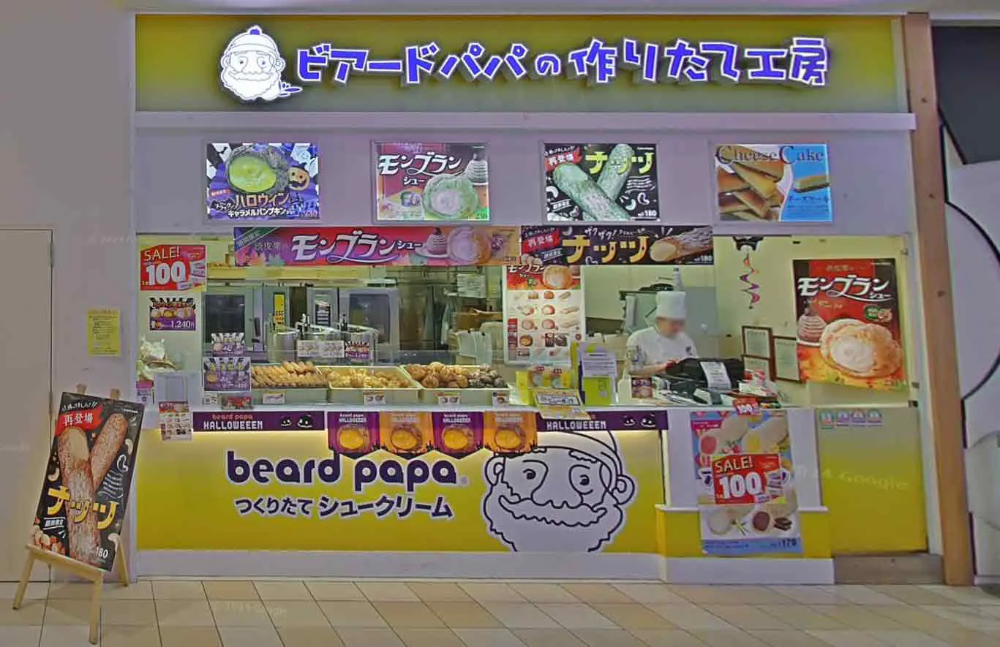

> 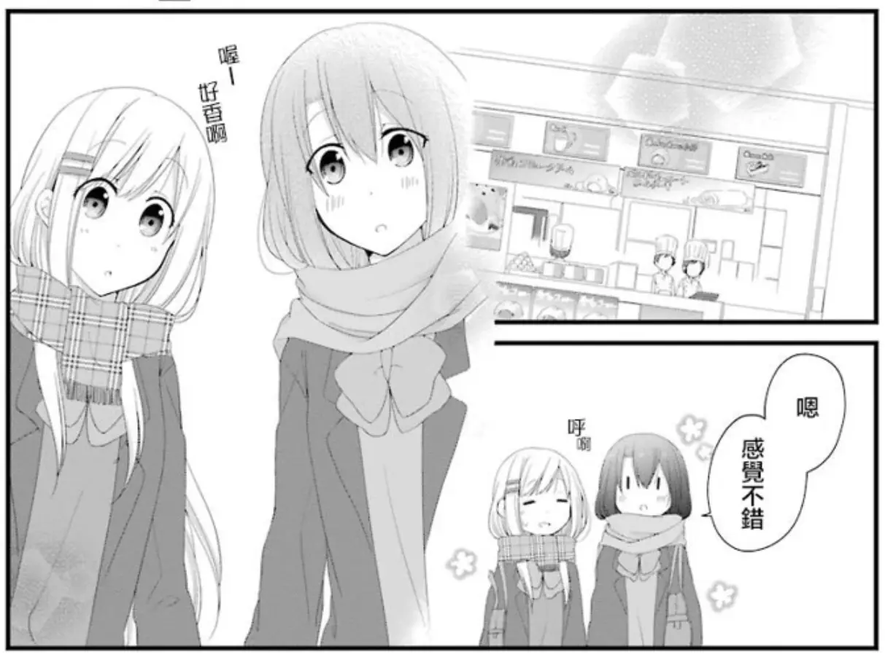

> 
>
> （因为B漫对招牌进行了汉化，所以这里使用日版截图）

#小说 #动画 #まに漫画 #柚原もけ漫画

#35.45404483515716, 136.67269825621798

[Google Map](https://maps.app.goo.gl/GLDrDYhhZfZTgu2AA)

#### 1F [54] フレッシュネスバーガー

小说第二卷「白色相簿」中，安达与岛村第一次圣诞约会后的午餐餐厅。

> > 我們在打完六局空氣曲棍球之後，便轉移陣地來到一樓的**鮮堡**裡喝茶。雖然已經過了中午，以午餐來說算有點晚，不過我們也順便在這裡吃了午餐。

> 
> 
> 

> 

> 小说餐点
>
> 安达：
>   - 冰咖啡（アイスコーヒー）
>
> 岛村：
>   - 冰咖啡（アイスコーヒー）
>   - 汉堡（バーガー）
>   - 土豆套餐（ポテトセット）

> 动画餐点
>
> 
>
> 安达：
>   - 经典汉堡（クラシックバーガー）
>   - 薯角（フライドポテト）
>   - 冰咖啡（アイスコーヒー）
>   - 番茄酱（ケチャップ）
>
> 岛村：
>   - 经典芝士汉堡+额外肉饼一片（クラシックチーズバーガー＋パティ1枚追加）
>   - 洋葱圈（オニオンリング）
>   - 玉米浓汤（コーンスープ）
>   - 番茄酱（ケチャップ）

※ 现已歇业

#已歇业 #小说 #动画 #柚原もけ漫画

#35.45390155987247, 136.67287481297757

[Google Map](https://maps.app.goo.gl/ewXwVEzsXNiokYVZ7)

#### 1F [55] しゃぶ菜

小说第三卷第一章「請挑選一個適合我的巧克力」中，安达找有情人节海报的店面时经过的涮涮菜。

> > 我們經過肯德基前面，經過大戶屋前面，最後再經過**涮涮菜**（註：日本涮涮鍋吃到飽連鎖店名）前面後，來到了別條路上。

> 

#小说

#35.4542574, 136.672786

[Google Map](https://maps.app.goo.gl/ijSetovp1ywVgVEm9)

#### 1F [57] 五穀 岐阜美濃店

动画第7话中作为背景出现。

> 
> 

#动画

#35.4546754, 136.6728939

[Google Map](https://maps.app.goo.gl/4nN7qWRKirZgNzh5A)

#### 1F [61] 大戸屋

小说第三卷第一章「請挑選一個適合我的巧克力」中，安达找有情人节海报的店面时经过的大戶屋。

> > 我們經過肯德基前面，經過**大戶屋**前面，最後再經過涮涮菜（註：日本涮涮鍋吃到飽連鎖店名）前面後，來到了別條路上。

> 

#小说

#35.4545407, 136.6730273

[Google Map](https://maps.app.goo.gl/z6pbUkGSo5d7iK4W9)

#### 1F [62] ケンタッキー

小说第三卷第一章「請挑選一個適合我的巧克力」中，安达找有情人节海报的店面时经过的肯德基。

> > 我們經過**肯德基**前面，經過大戶屋前面，最後再經過涮涮菜（註：日本涮涮鍋吃到飽連鎖店名）前面後，來到了別條路上。

> 

#小说

#35.4546565, 136.6730525

[Google Map](https://maps.app.goo.gl/z6pbUkGSo5d7iK4W9)

#### 1F インフォメーション総合案内

小说第二卷「白色相簿」中，安达与岛村第一次圣诞约会的见面地点。

> > 決定要約在購物中心裡的**市內綜合服務處**的人是我。

> 

> 
> 

> 安达提前了15分钟（10:45）开始等待，岛村则是在约定时间的前五分钟（10:55）到达。

<!-- 柚原もけ漫画第12话里，安达是在一个正对面有厕所标志的电梯的右侧的地图告示旁等待的，而不管是 ROSE PLAZA 还是 BLUE PLAZA 的电梯旁都没有同样式的地图告示，不如说モレラ岐阜因为是用的纸质地图告示，所以根本就不可能出现这么厚的地图告示 -->

#小说 #まに漫画

#35.4546183, 136.6725459

#### 1F エスカレーター・ROSE PLAZA

小说第二卷「白色相簿」中，安达第一次尝试牵岛村手的扶梯。

> > 綜合服務處的後面就有一個**電扶梯**。在來到電扶梯前時，我的視線飄往了島村不斷擺動的手。

> 

> 牵手失败后安达被岛村拉到了扶梯侧面的墙壁那边。
>
> > 大概是因為站在電扶梯前面會妨礙到別人吧，島村拉著我的手繞到電扶梯側面的牆壁那邊。

动画坐的是另一边「[BLUE PLAZA 的扶梯](#1f-エスカレーターblue-plaza)」

#小说

#35.4546654, 136.6725486

#### 1F [92] エディオン

小说第三卷第一章「請挑選一個適合我的巧克力」中，安达找有情人节海报的店面时岛村提到的 EDION。

> > 介紹上映中電影的牌子就位在我們的斜後方，一對由上到下看著那塊牌子的男女也牽著手。嗯，那才是普通情況。還有，走向**EDION**（註：日本連鎖家電量販店）的親子檔也是小男孩跟母親牽著手。

> 

#小说

#35.4552244, 136.6735146

[Google Map](https://maps.app.goo.gl/pWXXiuPrTkRsk3pW8)

#### 1F [93] JACK IN THE DONUTS

小说第三卷第一章「請挑選一個適合我的巧克力」中，安达找有情人节海报的店面时遇到的甜甜圈店。

> > 安達停下腳步，伸長脖子觀察店內。她甚至還伸長了身子。雖然我很不解她到底在做什麼，但還是默默看著她這麼做。我像是被安達拖著走似地，繞到了店面的正前方。位在入口旁邊的這間**甜甜圈店**幾乎沒有牆壁，在外面都能看見櫃檯的全貌。而這同時代表店員也可以看到我們。

> 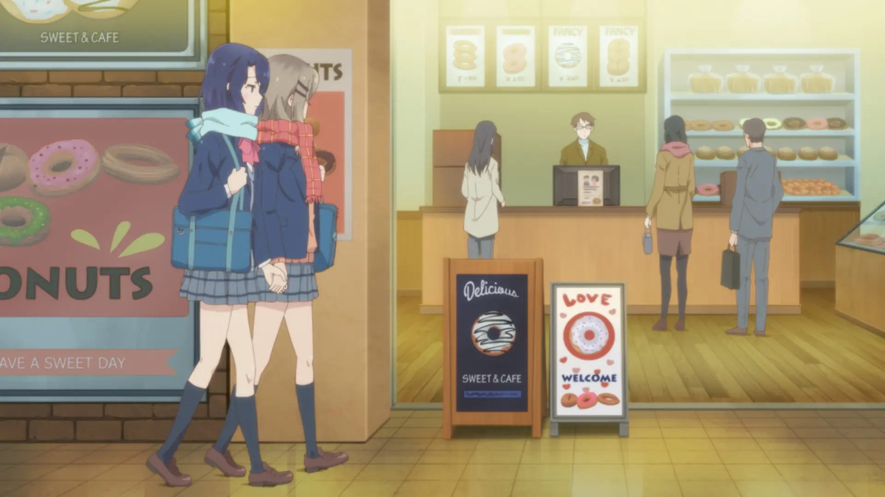

> 

> 

> 

※ 现已歇业

#已歇业 #小说  #动画 #まに漫画 #柚原もけ漫画

#35.45546281312502, 136.6736515509643

[Google Map](https://maps.app.goo.gl/S72NPsd32fth68L56)

#### 1F [100] ニトリ

动画11话中作为背景出现的商店。

> 

> 

#动画

#35.4562324, 136.6730627

[Google Map](https://maps.app.goo.gl/YRr2BJaW9YkbefxR9)

#### 1F [101] ワンラブ(ONE LOVE)

小说第四卷第三章「月與決心」中，安达偶遇樽见的宠物店。

> > 當我煩惱著這種事情走在邊緣走道上時，忽然聽見了很吵雜的聲音。那不是人的聲音，是動物的叫聲。我只轉動雙眼確認聲音來源，看來是間**寵物店**。最近新開的這間寵物店不只有狗跟貓，還有魚，而且現在好像還有羊──店家是這麼寫的。

> 

> 

> 安达的浏览顺序：熱帯魚 => 昆虫・爬虫類 => 鳥 => 犬・猫

#小说 #动画

#35.45612135632007, 136.67359007028415

[Google Map](https://maps.app.goo.gl/qqGLaqGCzoRALh5P6)

#### 1F GOLE PLAZA 東入口

小说第四卷第三章「月與決心」中，安达哭泣着离开商场时走的出入口。

> > 我在忍耐著的淚水滑落之前擦了擦眼睛，逃離鏡子前面。
> >
> > 我走往附近的入口，準備就這樣離開購物中心。原本是打算先盡快到外頭，再走到腳踏車停車場。

> 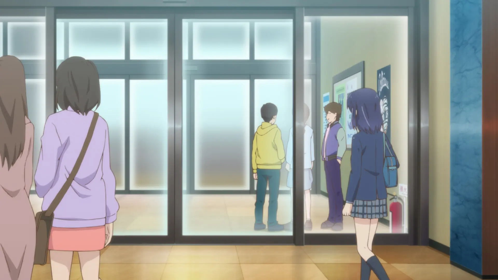

> 

#小说 #动画

#35.45635663987417, 136.67376481805866

#### 1F HUNT ディーラー前

小说第四卷第三章「月與決心」中，安达离开商场时遇到占卜师的停车场。

> > 原本是打算先盡快到外頭，再走到腳踏車停車場。不過在走到能看見入口時，我的視線不經意飄向了入口前面的一個地方。牆邊有個人在擺攤子。

> 
> 

> 
> 

#小说 #动画

#35.456343, 136.6738483

#### 2F [82] TSUTAYA BOOKSTOR

小说第三卷第三章「編織過去的荊棘，古典玫瑰」中，在遇到岛村前日野原本打算去的书店。

> > 「沒有，我只是來買漫畫。」
> >
> > 啊，原來她是想去二樓最裡面的書店啊。

> 

#小说

#35.45667901431334, 136.6725906654616

[Google Map](https://maps.app.goo.gl/sm4ARptGkZTRkFes6)

#### 2F [77] ABC-MART

小说第三卷第三章「編織過去的荊棘，古典玫瑰」中，岛村与妹妹、社妹、日野一起前往电影院路上经过的鞋店。

> > 我們走過三百圓商店和**鞋店**前面，抵達大大地用英文寫著某某電影院的地方。

> 

#小说

#35.455812, 136.6723884

[Google Map](https://maps.app.goo.gl/Qvr3DErids4DBFYbA)

#### 2F 椅子

小说第二卷第六章「白色相簿」中，安达与岛村交换圣诞礼物的地方。

> > 把剩下的咖啡在最後一口氣喝完以後，我們就離開了鮮堡。之後我們決定再上到二樓，坐到並排在電扶梯旁的兩張椅子上休息。
> >
> > 我心想現在這個時機應該不錯，於是決定在這時候把禮物拿給她。

> 

> 
> 

二楼的椅子貌似会定期更换，圣地巡礼册子里配图的座椅已被更换成新的样式。

（不过虽然圣地巡礼册子里配图拍的是这里的椅子，但考虑到离「[鮮堡](#1f-54-フレッシュネスバーガー)」的距离，我认为更有可能是距离更近的 BLUE PLAZA 二楼扶梯旁的座椅）

#小说 #动画 #柚原もけ漫画

#35.4555499, 136.6726954

#### 2F [91] TOHO シネマズ

小说第三卷第三章「編織過去的荊棘，古典玫瑰」中，岛村与妹妹、社妹、日野四人一起去的电影院。

> > 我們走過三百圓商店和鞋店前面，抵達大大地用英文寫著**某某電影院**的地方。招牌整體配色是紅色，售票處則全是藍色、昏暗的印象。

> 
> > 动画里日野没去

> 
> 

> 小说中社妹吃的是焦糖爆米花，动画则是咸味爆米花。

#小说 #动画

#35.4562795, 136.6734771

[Google Map](https://maps.app.goo.gl/Ubic8mSXFPFA8K1r8)

#### 2F [76] ラウンドワン

游乐场。

> 小说第一卷第四章「等邊TRIANGLE」中，俩人与社妹一起在其中玩了保龄球。（社妹使用了蓝色的球）
>
> > 吃完午餐之後，我們來到購物中心裡的**遊樂場**。吃完就回去的話也沒什麼意思，所以我和安達討論要不要在裡面逛逛買東西，隨即有個小朋友說這裡似乎很好玩而嬉鬧。缺乏自主性的我與安達，就這樣順其自然被帶來遊樂場。

> 小说第二卷「白色相簿」中，俩人一起在这里玩空气曲棍球。
>
> > 從推錢機旁邊經過，再繞過賓果遊戲的龐大機台後，我要找的東西就映入了眼簾。位於遊樂場深處的這個**空氣曲棍球機台**正是我要找的東西。

<!-- 其他 -->
> 
> 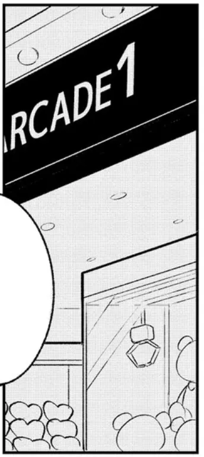
> 
> 

<!-- 保龄球 -->
> 
> 
> 
> 
> 
> 

<!-- 空气曲棍球 -->
> 
> 
> 

#小说 #动画 #まに漫画 #柚原もけ漫画

#35.4551435, 136.6733845

[Google Map](https://maps.app.goo.gl/ZWXop2gVBzQ17k5G6)

#### 2F [28] illusie300

小说第三卷第三章「編織過去的荊棘，古典玫瑰」中，岛村与妹妹、社妹、日野一起前往电影院路上经过的三百元店。

> > 我們走過**三百圓商店**和鞋店前面，抵達大大地用英文寫著某某電影院的地方。

> 

※ 已于 2024.1.14 歇业

#已歇业 #小说

#35.4540248, 136.6722121

[Google Map](https://maps.app.goo.gl/RDMmaFiHMa4MwyPT6)

#### 2F BLUE PLAZA 2階 エスカレーター手前

动画第6话中，安达牵手岛村失败后俩人对话的地方。

> 
> 

小说中是发生在「[ROSE PLAZA 的扶梯](#1f-エスカレーターrose-plaza)」旁。

#动画

#35.4538023, 136.6723891

#### BLUE PLAZA & GREEN PLAZA

> 
> 
> 

动画中多次出现了同一个 PLAZA，但现实的モレラ岐阜中没有一个 PLAZA 能完美符合动画。

- 明显的蓝色涂圈：BLUE PLAZA
- 一层柱子是平铺的小红砖：BLUE PLAZA、ROSE PLAZA
- 圆形透光玻璃天花板：ORANGE PLAZA、WHITE PLAZA
- 圆形天花板下有几条长方形玻璃：这是除 ORANGE PLAZA、WHITE PLAZA 这唯二圆形透光的广场外，其余几个 PLAZA 的特征

动画虽然有现实参考但改编程度过高，已经失去了考据和巡礼的意义，因此这里就不收录相关的动画场景了。感兴趣的话可以结合剧情前后的店面位置找最近的就好，不过其实也就 BLUE PLAZA 和 GREEN PLAZA 两个而已。

另外，现实中所有 PLAZA 平时都是空地，会根据活动需求进行布置，虽然圣诞时也会摆上圣诞树，但应该也不会摆上动画这样这么重的带有座椅的圣诞树吧。

## 尻毛 周辺

### 19. 川部公園

小说第三卷第三章「編織過去的荊棘，古典玫瑰」中，岛村偶遇做体操的社妹的公园。

> > 我看見跟墓地相連的小公園裡，有顆很醒目的頭。她綁在後腦杓的頭髮受到狂風吹拂，因而像是蝴蝶拍打翅膀般飛舞。

> 

> 同时也是动画中岛村摸安达头的公园
>
> 
> 
> 
>
> 考虑到上面十字路口就有自动贩卖机，并且位置也能和小说里两人从「[尻毛村](#尻毛村)」出发的行程相符合，可能这里也就是原作中岛村摸安达头的公园？

<!-- まに漫画第9话里的公园虽然乍看也挺像的，但P16底部的画面和这里还是差太多了，有儿童摇椅还有好多树 -->
<!-- 柚原もけ漫画第16话P24里的公园只出现了一格的滑梯，并且从下一页来看绝对不是这里，附近的居民房有点太城市化了 -->

> 
> 
> 

#小说 #动画

#35.4411249, 136.7070028

### 20.2 岐阜尻毛郵便局

小说第一卷「女高中生HOLIDAY」中，安达与其余三人一起去卡拉OK时的集合地点。

> > 我穿過只有和菓子店與腳踏車修理店營業的商店街，然後越過停駛鐵道的平交道左轉後，馬上就看見了當成會合地點的**郵局**。經過左手邊的銀行與公車站牌之後，靠在郵局招牌上等待的島村向我揮手。

> 
> 

> 
> 

> 
> 

※ 邮局旁的房子已于2022年拆除

#小说 #动画 #まに漫画

#35.4373041, 136.7156313

[Google Map](https://maps.app.goo.gl/refcEpaq7DNEwYg6A)

<!-- 编号没有按顺序是为了和圣地巡礼册子中的编号保持一致 -->

#### 20.1 右方的橋

小说第一卷「女高中生HOLIDAY」中，日野和永藤骑车过来一起去唱卡拉OK的桥。

> > 但日野與永藤像是察覺到我有這個念頭般同時抵達。她們共乘腳踏車經過右方的橋而來。

#小说

#35.4371748, 136.7169225

#### 20.3 电线杆

动画第4话出现的电线杆

> 
> 

#动画

#35.4377043, 136.7146106

#### 岐阜銀行尻毛出張所

小说第一卷「女高中生HOLIDAY」中，安达前往集合地点时提到的银行。

> > 我穿過只有和菓子店與腳踏車修理店營業的商店街，然後越過停駛鐵道的平交道左轉後，馬上就看見了當成會合地點的郵局。經過左手邊的**銀行**與公車站牌之後，靠在郵局招牌上等待的島村向我揮手。

> 

※ 已于2012年歇业，现改为停车场

[by 入间人间 Wiki](https://irumahitoma.fandom.com/zh/wiki/舞台/岐阜县#尻毛-西改田地区)

#已歇业 #小说

#35.4378906, 136.7144906

#### 20.4 站牌

小说第一卷「女高中生HOLIDAY」中，安达前往集合地点时提到的公车站牌。

> > 我穿過只有和菓子店與腳踏車修理店營業的商店街，然後越過停駛鐵道的平交道左轉後，馬上就看見了當成會合地點的郵局。經過左手邊的銀行與**公車站牌**之後，靠在郵局招牌上等待的島村向我揮手。

> 

（圣地巡礼册子里的配图拍错了，是对面停车场旁的站牌）

#小说

#35.4377789, 136.7142626

[Google Map](https://maps.app.goo.gl/rMAdG1AfSq6eDJpWA)

#### 20.5 末廣屋本店

小说第一卷「女高中生HOLIDAY」中，安达前往集合地点时提到的和果子店。

> > 我穿過只有**和菓子店**與腳踏車修理店營業的商店街，然後越過停駛鐵道的平交道左轉後，馬上就看見了當成會合地點的郵局。經過左手邊的銀行與公車站牌之後，靠在郵局招牌上等待的島村向我揮手。

> 

#小说

#35.4379986, 136.7137987

[Google Map](https://maps.app.goo.gl/8SsYKjaiUdcXYe556)

#### 20.6 旧名鉄揖斐線 尻毛駅跡

小说第一卷「女高中生HOLIDAY」中，安达前往集合地点时的提到的废弃铁道。

> > 我穿過只有和菓子店與腳踏車修理店營業的商店街，然後越過**停駛鐵道**的平交道左轉後，馬上就看見了當成會合地點的郵局。經過左手邊的銀行與公車站牌之後，靠在郵局招牌上等待的島村向我揮手。

> 

在2005年全面停运，随后拆除。

#小说

#35.4382606, 136.7133295

#### 20.7 自行车修理店

小说第一卷「女高中生HOLIDAY」中，安达前往集合地点时的提到的自行车修理店。

> > 我穿過只有和菓子店與**腳踏車修理店**營業的商店街，然後越過停駛鐵道的平交道左轉後，馬上就看見了當成會合地點的郵局。經過左手邊的銀行與公車站牌之後，靠在郵局招牌上等待的島村向我揮手。

> 

#小说

#35.4387112, 136.7130292

[Google Map](https://maps.app.goo.gl/F5koGRgpYo6fxZFA6)

#### 尻毛村

小说第一卷「女高中生HOLIDAY」中，安达与岛村日野永藤一起唱卡拉ok的地方。

> > 建築物外面高掛「**某某村**」的名稱，裡面同時有托兒所、燒肉店、小餐館與KTV。雖然排隊進場方式亂得像是忘記節操這個詞該怎麼寫一樣，但停車場滿是車輛。

> 
> 

> 

> 

※ 已于2012年歇业，现已重建为养老院（ぬくもりの里笑和）

柚原もけ漫画改为在「[カラオケ館 岐阜駅前店](#カラオケ館-岐阜駅前店)」唱卡拉ok。

[by 入间人间 Wiki](https://irumahitoma.fandom.com/zh/wiki/舞台/岐阜县#尻毛-西改田地区)

#已歇业 #小说 #动画 #まに漫画

[Google Map](https://maps.app.goo.gl/hhX1PE8pCRih4gs36)

#35.4381132, 136.7148852

#### 永藤日野的告别场景

动画第4话中，永藤日野的告别场景。

> 
> 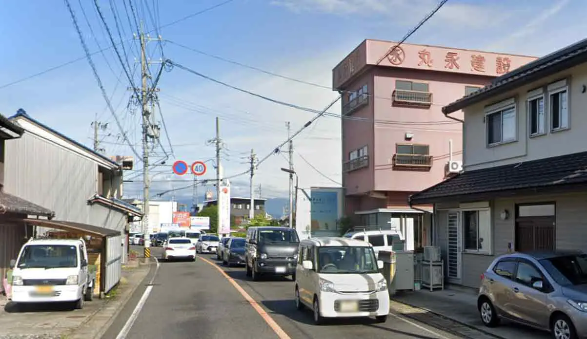

#动画

#35.43755519962905, 136.71537568605174

### 21. 島西運動場

小说第七卷第三章「平凡至極的話語」中，安达选择的与岛村第一次约会的地点。

> > 目的地就在走過兩條行人穿越道，再轉個彎的地方。那是就蓋在附近的**市營運動場**。

> 扔完回旋镖后，两人一起在长椅上吃岛村亲手制作的鸡蛋三明治。
>
> 

※ 使用运动场需要提前预约

#小说

#35.431832, 136.7230387

[Google Map](https://maps.app.goo.gl/NwExfQL3hAJXmfaQA)

### 22. スポーツクラブ アクトス

岛村妈妈经常去的健身房。

> 小说第二卷「島村 前往健身房」中，岛村在这里偶遇安达妈妈进行了桑拿比赛。
>
> > 我們通過商店街那邊的大橋之後，又經過市內運動場，大概從這時候開始能看見一塊藍白色的招牌，配色讓人想起寶礦力水得的招牌上用英文寫著**健身房**的名稱。

> 小说第五卷第三話「靈魂是共有的？」中，安达与岛村和好后一起来这里游泳。
>
> > 一面以藍色和白色構成，配色看起來極為清爽的招牌迎接我們的到來。**健身房**跟對街的停車場都停滿了車子。

> 小说第七卷第三章「平凡至極的話語」中，安达与岛村第一次约会的会合地点，之后俩人前往了「[21. 島西運動場](#21-島西運動場)」。
>
> > 我們約好會合的地點是在顯得有些無趣的**運動健身房**前面。之前曾跟島村一起來過。

> 
> 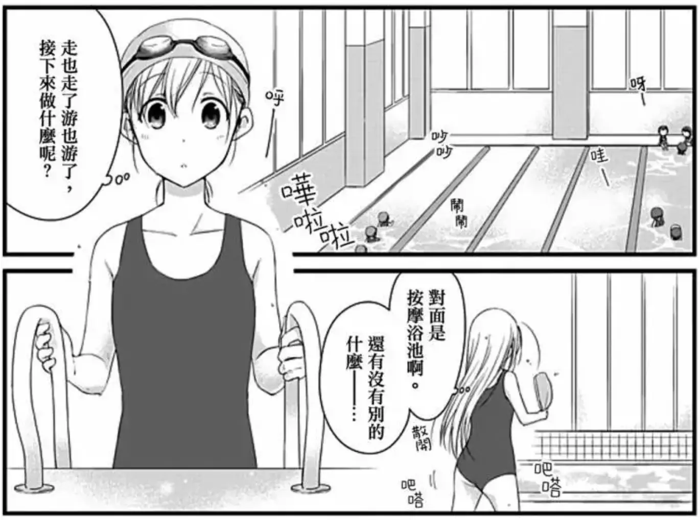
> 

> 
> 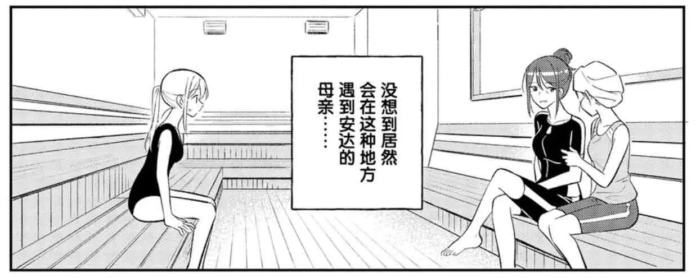
> 

> 
> 
> 

> 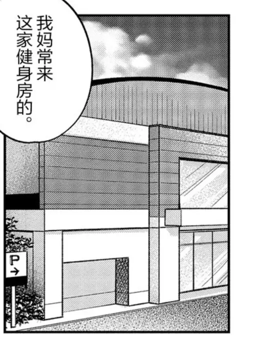
> 
> 
> 

#小说 #动画 #柚原もけ漫画

#35.4293547, 136.7251489

[Google Map](https://maps.app.goo.gl/wBTaZgMo5chwK1Qi9)

### 23. カルコス 本店

小说第七卷第三章「平凡至極的話語」中，安达寻找约会特刊与永藤偶遇的书店。

> > 經過一座橋後，就抵達了**書店**。那是很久以前就存在的大書店，外表是像紅磚一樣的顏色。

<!-- 柚原もけ漫画 第11话p1 有出场，但和现实差得太多了，看标志更像是「2F [82] TSUTAYA BOOKSTOR」 -->

> 

#小说

#35.425051, 136.7335431

[Google Map](https://maps.app.goo.gl/D3NMtF3bEPpMF5X69)

### Ｖ・drug 岐阜島南店

小说第七卷第三章「平凡至極的話語」中，安达寻找约会特刊与永藤偶遇的书店旁边的药局。

> > 原本蓋在旁邊專門販賣遊戲跟CD的大間店面，不知何時變成**藥局**了。

> 「販賣遊戲跟CD的大間店面」 指的是「マジカルガーデン 岐阜島店」，已于 2014.9.21 歇业

> 

[by 入间人间 Wiki](https://irumahitoma.fandom.com/zh/wiki/舞台/岐阜县#尻毛-西改田地区)

#小说

[Google Map](https://maps.app.goo.gl/vmDzecauY1EhtYi28)

#35.424804559664345, 136.73468623687108

### 24. 島南公園

小说第七卷第三章「平凡至極的話語」中，安达被永藤拉着进行回旋镖特训的公园。

> > 這座蓋在購物中心……一座寬敞程度微妙到我不知道該不該這麼稱呼，總之就是蓋在一間綜合購物大樓旁邊的**公園**裡，只有我跟永藤。

小说中永藤回家放了东西并换上了写有师傅的T恤后，还能比没换制服的安达更早到达公园。考虑到永藤不会骑自行车，永藤的家可能就在附近。

> 

#小说

#35.4239931, 136.7347029

[Google Map](https://maps.app.goo.gl/zV3WqsktbkHcb5qH7)

### 25. トミダヤ島店

小说第七卷第三章「平凡至極的話語」中，安达与永藤进行回旋镖特训的公园附近的购物中心。

> > 這座蓋在購物中心……一座寬敞程度微妙到我不知道該不該這麼稱呼，總之就是蓋在一間**綜合購物大樓**旁邊的公園裡，只有我跟永藤。

> 

（实际就是一家只有一层楼的超市而已，并不是大楼）

#小说

#35.4238074, 136.7359193

[Google Map](https://maps.app.goo.gl/wXZ2VoqbmwkWxgkHA)

### 大縄場大橋

小说第七卷第三章「平凡至極的話語」中，安达前往书店寻找约会特刊时经过的大桥。

> > 經過一座**橋**後，就抵達了書店。那是很久以前就存在的大書店，外表是像紅磚一樣的顏色。

[by 入间人间 Wiki](https://irumahitoma.fandom.com/zh/wiki/舞台/岐阜县#尻毛-西改田地区)

#小说

#35.4233082, 136.7425212

[Google Map](https://maps.app.goo.gl/SMmajQZrhEo9EpbZ8)

### 大縄場大橋公園

小说第十一卷「Ever15」中，岛村清晨投篮遇到和服女的地方。

> > 我走到離家很遠的地方，過一條長長的橋。它不算大，是從橋上到橋下的距離很長。從轉了好幾圈的螺旋橋來到下方，看到無人打掃導致邊角已經發黑的長椅，還有一樣缺乏清理的籃球架。我走到六角形的磁磚上，也依然不停下正在運球的手，並同時確定沒有其他人在用籃球架。

> 
> 
> 

※ 实际并没有篮球架

[by 微博@甘井文](https://weibo.com/7651616302/O5Vjqawba)

#小说

#35.4231846, 136.7450939

### 又丸公園

小说第十一卷的G店特典「今昔公园风景」中，安达向岛村求婚的地方。

> > 追寻着记忆，来到了被树木环绕绿意盎然的公园。这是个建在神社附近的公园，我以前……经常和最要好的朋友一起来。

> > 摸了摸长椅，发现似乎有被好好打扫过。
> >
> > 既没有黏黏的感觉也没有垃圾。将新落下的叶子拨扫开，我们两人便坐在长椅上。
>
> 

[by 微博@甘井文](https://weibo.com/u/7651616302)

#小说

#35.4352461, 136.7012009

[Google Map](https://maps.app.goo.gl/LwgbKvbdrin5zij37)

## 長良川 周辺

### 26. 昇龍

安达打工的中华饭店的原型。

> > 這間店外觀上的紅色跟黃色依然散發著強烈的存在感，顯得跟其他建築物有點格格不入。不過，這種店搞不好就是要醒目一點才比較剛好。我走過停車場的車子旁邊，看往店內。

> 
> 
> 
> 
> 
> 

> 

> 
> 
> 

> 
> 
> 
> 

老板娘是中国人，进门可以直接用中文沟通。

---

提到的菜单

> 小说第一卷「安達QUESTION」中，安达提到了「炸雞塊（からあげ）」
>
> > 店長與店員也盡是台灣人，其中甚至有人仍然幾乎不會講日語。店的外觀一定會大幅使用黃色，午餐很便宜，**炸雞塊**也大得很誇張。

> 小说第一卷「安達QUESTION」中，岛村一家来用餐时岛村妹提到了「魚翅（フカヒレ）」
>
> > 島村妹看著島村打開的菜單。「**魚翅**好貴喔！」她驚訝地瞪大雙眼嬉鬧著。「不准點喔。」父親如此叮嚀，實際上的確也希望你們不要點魚翅。就算點了，我們也端不出這種東西。這就是沿用菜單的壞處。

> 小说第二卷「安達思考中聖誕節進行中」中，安达提到了「饺子（餃子）」
>
> > 從大陸來的人們之間的情誼似乎相當堅固。雖然我覺得連菜單都是每間店用一樣的這點，實在讓人難以認同。彩色照片上的**餃子**豈止是數量不同，連形狀都不一樣。

> 小说第十卷『Astray from the Sentiment』中，安达在搬去和岛村同居的前一天来店里打招呼时点的晚餐是「包含了炒饭、小碗拉面、果冻、炸肉块的套餐（定食：炒飯・小ラーメン・小ゼリー・唐揚げ）」
>
> > 這份定食有炒飯、小碗拉麵，還有一個勉強能當甜點的色彩繽紛的果凍。擺在邊角的盤子上裝的炸肉塊大到超出托盤的上面跟左邊。這份炸肉塊就像岩礁一樣，很多尖角。雖然很讓人懷念，但裝了三到四塊會很擔心吃不完。

#小说 #动画 #まに漫画 #柚原もけ漫画 #晚上巡礼

#35.438649, 136.764306

[Google Map](https://maps.app.goo.gl/fFGMePTQYTmSQzLr7)

### 27. 金華橋

在小说第五卷「來自蔚藍」和第十卷「The Sakura's Ark」中，樽见在桥底的河滩上画下了岛村。

> > 所以，我來到了約好的地點。她約在長良川的金華橋底下。我曾在通過橋的時候俯視底下釣客的身影，可是不知道已經幾年沒有自己走下河灘，踩著這裡的沙礫了。
> >
> > 在這個河灘上可以一口氣看見金華山跟岐阜城。

> > 冬天的河邊沒有其他人在，這或許沒什麼好意外的。陽光也開始隱約散發出一絲深橘色彩。

> 
> 

> 
> 
> 
> 

旁边流淌的长良川以五月至十月季节的鸬鹚捕鱼而闻名。夏季时也会举办小说中提到的全国烟火大赛和祭典。

#小说 #柚原もけ漫画

#35.434235, 136.7616581

### 28. 長良川観光ホテル石金

动画BD第三卷初回限定版特典小说「MURA」中，安达与岛村入住的温泉旅馆。

> > 走出房间，经过画着养鸬鹚情景的螺钿画，看到休息处后，按照告示的指引继续朝里面走，结果真的出现了。
> >
> > 芥子色的窗帘拦着左右两边的窗户，摆在房间中央的，是两张蓝色的乒乓球台。
>
> （实际并没有乒乓球桌）

> 

> 养鸬鹚情景的螺钿画就在进门左手边
>
> 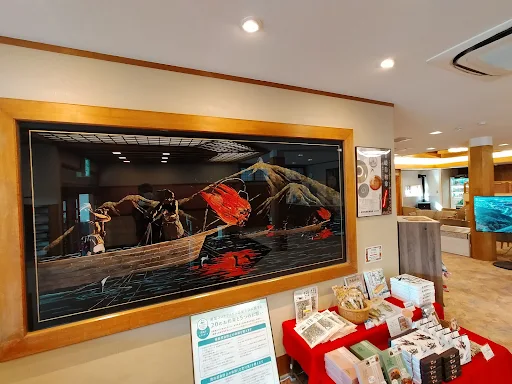

> 她们所使用的房间是一楼本馆的「鶴」「翡翠」「篝」「山吹」中的一个。
>
> 

入选「日本温泉100选」的温泉可以一日游，足浴则是免费的。

#小说

#35.4407675, 136.7746286

[Google Map](https://maps.app.goo.gl/5kqtUipHC6qYK3pEA)

### 29. 金華山

在小说第五卷「來自蔚藍」中，安达去金华桥底见樽见时提到的金华山。

> > 在這個河灘上可以一口氣看見**金華山**跟岐阜城。我最後一次搭建在那座山上的纜車，是幾歲的時候呢？現在因為我妹也已經長大，所以也不太會出遊了。

> 
>
> 右下角就是金華山

> 

> 岛村小时候坐过山上的缆车。

金华山名称的由来是其山上的「ツブラジイ」，当其淡黄色花朵盛开时，在夕阳的照射下会呈现出非常漂亮的金色光芒，最佳观赏时间是四月下旬至五月初。「ツブラジイ」还是岐阜市的市树。

#小说 #动画

#35.4333723, 136.7811761

[Google Map](https://maps.app.goo.gl/ve2UpgAJPJSPyFtKA)

## 大垣～岐阜 周辺

### 30. 大垣駅

动画第9话中，安达岛村樽见三人都在这个车站搭乘JR前往名古屋。

> 
> 
>
> 
> 
>
> 
> 
>
> 
> 
>
> 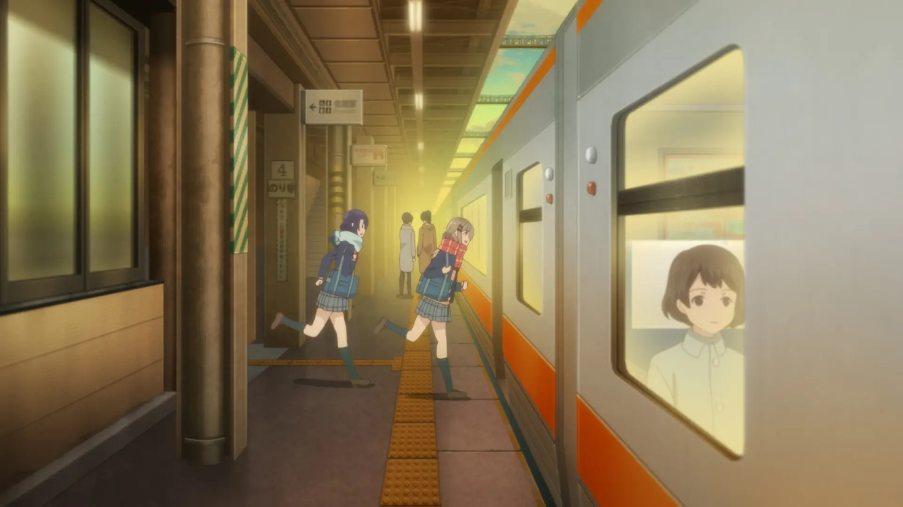
> 

#动画

实际小说中安达岛村樽见三人都是在「[33. 岐阜駅](#33-岐阜駅)」搭的JR。

#35.3667775, 136.6178259

[Google Map](https://maps.app.goo.gl/SULsPn7fqsWsDjid6)

### 31. 鉄板厨房天てん 北方店

小说第四卷第二章「春與月」中，樽见与岛村一起吃什锦烧的店。

> > 樽見帶我來吃午餐的地方，是什錦燒店。這是間好像叫作鐵板廚房還是什麼的店，每個餐桌都有設置鐵板。也就是叫客人自己煎。

> 
> 

> 
> 

> 樽见为岛村煎的是岛村小时候喜欢的起司味什锦烧，并且面团里没有加入卷心菜。

※ 已于 2021.4 歇业

#已歇业 #小说 #动画 #柚原もけ漫画

#35.4125787, 136.6904609

[Google Map](https://maps.app.goo.gl/YnRnXS9Qd4f2W5kC9)

### 32. 長良川橋梁

动画第9话中，安达与岛村搭车前往名古屋时出现的场景。

> 
> 

> 

（圣地巡礼册子中的坐标有误，跑到桥的另一边去了）

※ 由于道路交通量大，拍摄时请注意安全

#动画 #柚原もけ漫画

#35.3979661254506, 136.70022047082355

### 33. 岐阜駅

> 

> 小说第一卷「未來FISHING」中,安达与岛村第一次在放学后去买甜甜圈吃的车站。
>
> > 我們進入兩層樓構造、看起來不是很高級的**車站**，再進入門口左邊的「Mister Donut」。

> 小说第三卷第三章「編織過去的荊棘，古典玫瑰」中，樽见与岛村搭车前往名古屋的车站。
>
> > 我逆著夾雜國小、國中、高中學生的返家人潮，猛速騎到**車站**，急忙趕往甜甜圈店，發現樽見已經到了。

> 小说第三卷第四章「以及擁抱聖母的愛，金盞花」中，安达与岛村搭车前往名古屋的车站。
>
> > 到**車站**之後，島村說：「啊，用跑的就能趕上電車。」於是我們跑了起來。雖然我很疑惑她怎麼會知道電車的時間，但我在開始思考之前先動起了雙腳。

> 小说第五卷第四话「安達再起」中，安达与岛村约好的集合地点。
>
> > 我們約好在**車站**前面集合。

> 小说第七卷「如果沒有在體育館二樓相遇」中，安达与岛村搭乘电车的车站。
>
> > 我搭公車到**車站**，再去地下鐵轉搭電車。

> 小说第十卷「The Sakura's Ark」中，岛村与樽见约好在附近的公交车站见面。
>
> > **車站**這種地方就算常常來，也沒什麼機會搭電車。我在約好見面的公車站附近徘徊，確定沒有看到樽見，才站到導覽圖旁邊。

> 小说第十卷「Cherry Blossoms for the Two of Us」中，安达与岛村约好的见面地点。
>
> > 我們是約在**車站**裡見面。這是我這個月第二次跟人約在車站了。上一次是往外走，現在是往裡面走。

- [显示一楼地图](#show:gifu-1)

地图：<https://www.nsk-eki.com/asty-gifu/map/>

#小说 #动画 #柚原もけ漫画 #まに漫画

#35.40941368182419, 136.75735261063824

[Google Map](https://maps.app.goo.gl/DDva61pDr5PuP1tp9)

#### 33. 1F [10] モスバーガー

小说第一卷「未來FISHING」中岛村提到的摩斯汉堡店。

> > 這間車站有很多讓白領族下班喝酒的店，卻幾乎沒有我們會去的店。一樓雖有超市、麵包店與**摩斯漢堡**，卻都是賣吃的地方。

> 

#小说

#35.40965889520743, 136.75651748824401

[Google Map](https://maps.app.goo.gl/VPgAN6DTt13nDGdR7)

#### 33. 1F [7] ヴィ・ド・フランス

小说第一卷「未來FISHING」中岛村提到的面包店。

> > 這間車站有很多讓白領族下班喝酒的店，卻幾乎沒有我們會去的店。一樓雖有超市、**麵包店**與摩斯漢堡，卻都是賣吃的地方。

> 

#小说

#35.40943742225845, 136.7568015841656

[Google Map](https://maps.app.goo.gl/D7JYTdziJyZQEF7v8)

#### 33. 1F [15] Mister Donut

小说第一卷「未來FISHING」中，安达与岛村一起去吃的甜甜圈店。

> > 我們進入兩層樓構造、看起來不是很高級的車站，再進入門口左邊的「**Mister Donut**」。

> 
> 

> 

> 
> 
> 

> > 「我每次來都會猶豫，但還是**天使法蘭奇**吧。我還打算買兩個給妹妹當伴手禮。」
> >
> > 即使看得眼花撩亂，最後還是大多決定買這種。因為小時候母親買甜甜圈給我當點心時就是買這種，我覺得有點像是銘印現象。
>
> 岛村吃的是「エンゼルフレンチ（天使法蘭奇）」
>
> 

> > 安達選的是下排的**蜜糖多拿滋**。她大概不喜歡和別人一樣吧。
>
> 安达则是「ハニーディップ（蜜糖多拿滋）」
>
> 

> > 妹妹應該吃一個就夠了。畢竟要是買太多點心導致晚餐吃不下會讓母親生氣。我煩惱該留下哪一個之後，將**卡士達巧貝**遞給社妹。
>
> 岛村送给社妹吃的是「カスタードクリーム（卡士達巧貝）」
>
> 

#小说 #动画 #柚原もけ漫画 #まに漫画

#35.40952420877534, 136.75784568597732

[Google Map](https://maps.app.goo.gl/Avz6pdgy7WXNkGRP8)

#### 33. 1F [16] 成城石井

小说第一卷「未來FISHING」中岛村提到的超市。

> > 這間車站有很多讓白領族下班喝酒的店，卻幾乎沒有我們會去的店。一樓雖有**超市**、麵包店與摩斯漢堡，卻都是賣吃的地方。

> 

#小说

#35.40949771432277, 136.7580400229175

[Google Map](https://maps.app.goo.gl/v4m4Pa3cNZVHQmJL6)

#### 33. 1F [5] 薬 マツモトキヨシ

小说第一卷「未來FISHING」中岛村提到的松本清药局。

> > 裡面有一家**松本清藥局**，但沒必要刻意去逛。

> 
> 

> 

※ 已于 2024.2.29 歇业

#已歇业 #小说 #动画

#35.40931657427805, 136.7579780349833

[Google Map](https://maps.app.goo.gl/UQjBcrqv35hXGCeg8)

#### 33. 1F 电扶梯旁的墙壁

小说第一卷「未來FISHING」中，安达与岛村一起吃甜甜圈的地方。

> > 排隊等了很久總算結帳完走出店門之後，我們決定靠在電扶梯旁的牆壁吃。

> 小说第三卷第三章「編織過去的荊棘，古典玫瑰」中，樽见等岛村一起去买巧克力的地方。
>
> > 她穿著制服，卻沒拿書包，在我以前跟安達一起吃甜甜圈的地方等我。

（位置是随便选的，扶梯旁有很多可以靠着吃东西的墙壁）

#小说

#35.40930226452022, 136.75760520153943

#### 33. 1F 上行电扶梯

> 

#柚原もけ漫画

#35.409487448885216, 136.75752699466818

#### 33. 1F 下行电扶梯旁的柱子

动画和柚原もけ漫画中，安达与岛村一起吃甜甜圈的地方。

> 
> 
> 
> 
> 

> 
> 

※ 小说是在「[33. 电扶梯旁的墙壁](#33-电扶梯旁的墙壁)」边上吃的

#动画 #まに漫画 #柚原もけ漫画

#35.40939720880522, 136.75751370634543

#### 33. 2F 1号站台

> 
> 

[by 推特@はにすけ](https://twitter.com/_hanisuke/status/1720388756535149014)

#柚原もけ漫画

（坐标是根据照片外的建筑大致推测的，有待实地巡礼修正）

#35.4095486, 136.7571049

#### 33. 2F 中央检票口

> 
> 

[by 推特@はにすけ](https://twitter.com/_hanisuke/status/1720388756535149014)

#柚原もけ漫画

#35.40951793064963, 136.7566876130791

#### 33. 1F 站内通道

> 
> 

（以前站内通道顶部和漫画一样是有类拱顶结构的，但现在已经没了）

#柚原もけ漫画

#35.409498866255376, 136.75727044863578

#### 33. 1F 岐阜市ステーションプラザ

柚原もけ漫画中，安达与岛村第一次牵手的地方。

> 
> 

[Google Map](https://maps.app.goo.gl/V6hiHncivsbFewwh9)

#柚原もけ漫画

#35.40941082749987, 136.7571438740212

#### 33. 1F 中央北口旁扶梯

> 
> 

（虽然实际电梯样式完全不同，但在考虑到剧情前后的地理位置，确实就是这个扶梯）

#柚原もけ漫画

#35.40959258486676, 136.7569644207271

#### 33. 中央南口内

> 
> 

#柚原もけ漫画

#35.40934770202813, 136.7566317667471

#### 33. 中央南口外

> 
> 
> 

[by 推特@はにすけ](https://twitter.com/_hanisuke/status/1719989422681448776)

#柚原もけ漫画

#35.4092209, 136.7566071

#### 33. 中央南口前の広場

柚原もけ漫画中，安达与岛村在车站外遇到岛村中学同班同学的地方。

> 
> 

> 
> 
> 

[by 推特@はにすけ](https://twitter.com/_hanisuke/status/1719989415769264313)

#柚原もけ漫画

#35.4090722, 136.7566968

#### 33. 第一次牵手的楼梯

小说第一卷「未來FISHING」中，安达第一次牵上岛村手的楼梯。

> > 並肩行走的安達，握住我的手。
> >
> > 事出突然，我不由得停下腳步轉頭看向她。眼神和安達相對，發現她像是在觀察我的反應，心神不寧且眼神游移。

> 

（不过小说里写的是「離開車站行走一小段路後」「有可能是因為我心不在焉，不經意晃到馬路上，她才一時情急拉我的手阻止我」，并没有楼梯相关的描写，不知道为啥巡礼册子会在「33. 階段」里写是在这里牵的手）

#小说

#35.4099534, 136.7570159

### 34. 玉宮通り

小说第十卷封面的取景地。

> 
> 

※ 道路人流量较大，建议清晨尽早来拍摄

#小说

#35.4126388888889, 136.757916666667

### カラオケ館 岐阜駅前店

柚原もけ漫画中，安达与岛村日野永藤一起唱卡拉ok的地方。

> 
>
> （因为B漫对招牌进行了汉化，所以这里使用日版截图）
>
> 

小说是在「[尻毛村](#尻毛村)」里唱的卡拉ok，柚原もけ漫画改为了这里。

[by 推特@はにすけ](https://twitter.com/_hanisuke/status/1720388762340135355)

#柚原もけ漫画

[Google Map](https://maps.app.goo.gl/suQ8XaFqVEBt7pyu7)

#35.4126071139244, 136.75847944579513

### ローソン 岐阜長住三丁目店

柚原もけ漫画中，安达与岛村唱完卡拉ok分开后，安达骑车经过的便利店。

> 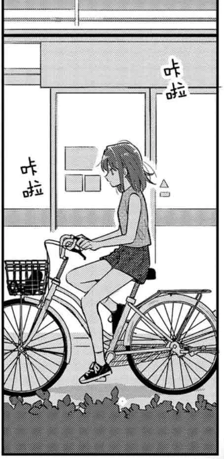
> 

[Google Map](https://maps.app.goo.gl/bFB8yeMnwq3T52qw8)

[by 推特@はにすけ](https://twitter.com/_hanisuke/status/1720388771601076292)

#柚原もけ漫画

#35.41237850711255, 136.75883377911043

### 十六銀行 本店

柚原もけ漫画中，安达与岛村唱完卡拉ok分开后，安达骑车经过的地方。

> 
> 
> 
> 

[by 推特@はにすけ](https://twitter.com/_hanisuke/status/1720388776617496619)

[Google Map](https://maps.app.goo.gl/iP8JUwxc2WX1kPc97)

#柚原もけ漫画

#35.41234991133427, 136.7592037845813

### 岐阜駅前中央商店街 名鉄岐阜駅前

柚原もけ漫画中，安达与岛村唱完卡拉ok后，岛村骑车离开的地方。

> 
> 

[by 推特@はにすけ](https://twitter.com/_hanisuke/status/1720388767553564944)

#柚原もけ漫画

#35.4122325, 136.7597241

## 各務原 周辺

### 35. イオンモール各務原

小说第二卷「安達思考中聖誕節進行中」「島村思考中聖誕節進行中」中，安达与日野、岛村与永藤互相购买圣诞礼物的购物中心。

> 
> 
>
> 现实中没有动画这样突出的招牌

> 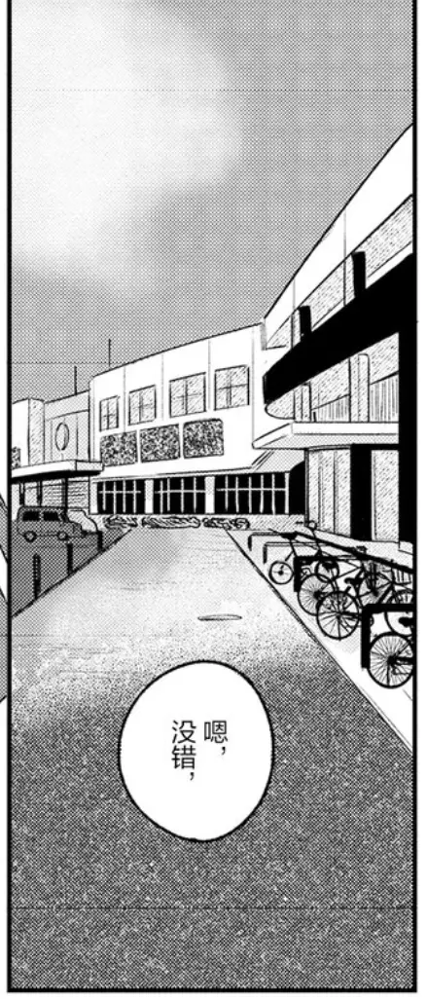
> 

※ 设施内禁止拍摄，如有需要请联系相关人员获取许可

地图：<https://www.aeon.jp/sc/kakamigahara/shop/floor/ebook/kakamigahara>

[Google Map](https://maps.app.goo.gl/toCkfR9De71FPx6U7)

#小说 #动画 #柚原もけ漫画

#35.3924558, 136.8232036

#### 35. ペットショップ側入口

小说第二卷「安達思考中聖誕節進行中」中，安达与日野进入购物中心的入口。

> > 我們從一樓寵物店旁邊的入口進入購物中心。

#小说

#35.3926243, 136.8215346

#### 35. イオンスタイル食品売場側入口

小说第二卷「島村思考中聖誕節進行中」中，岛村与永藤进入购物中心的入口。

> > 我們通過吸菸區前面，進入購物中心。

※ 吸烟区现在已经没了

[by 微博@滨名远江](https://weibo.com/7289018178/ImiLv4lXU)

#小说

#35.39143077133839, 136.8248509089323

#### 35. 1F [2] ペテモ

小说第二卷「安達思考中聖誕節進行中」中，安达与日野进入购物中心的入口旁的宠物店。

> > 我們從一樓**寵物店**旁邊的入口進入購物中心。

#小说

#35.392539, 136.8217611

[Google Map](https://maps.app.goo.gl/kPrwyctQ3RdCXJFV7)

#### 35. 1F [54] スターバックスコーヒー

动画第6话中，安达与日野在店内休息时看到了结伴出行的岛村与永藤。

> 
> 

> 

> 

#动画 #柚原もけ漫画

#35.3924565, 136.8231224

[Google Map](https://maps.app.goo.gl/bp5LSKivprmDSeKaA)

#### 35. 1F [33] ポニークリーニング

小说第二卷「島村思考中聖誕節進行中」中，永藤看到的洗衣店。

> > 在走了一小段路以後，接著便看見**洗衣店**跟腳底按摩店（有熊的圖樣），於是她就說：「那洗衣機呢？」

#小说

#35.3922974, 136.8241723

[Google Map](https://maps.app.goo.gl/w6dtuTqZUvM7rkF27)

#### 35. 1F [44] 三國屋善五郎

小说第二卷「安達思考中聖誕節進行中」中，安达与日野光顾的茶店。

> > 經過購物中心裡那每週都會賣不同商品的蛋糕賣場跟酒品賣場前面之後，就看到了麵包店對面那間位於十字路口一角的茶店。光聽到「茶」這個字的時候，腦海裡是模糊浮現了綠色的印象，不過店裡是以褐茶色居多。這是因為櫃子上陳列著許多裝有茶葉的袋子。招牌上刻有像是古代人名的文字，應該是唸做「**三國屋**」吧。

> 
> 

> 

> 

> 安达在这里购买了岛村喜欢的「Legend of Africa」茶叶作为礼物。该款茶叶原本已经停产，但受动画的影响而重新上市。
>
> 
> 
> 
>
> （因为B漫对名字进行了汉化，所以这里使用日版截图）
>
> 
> 

> 日野被家人拜托买了「生姜の焙茶」
>
> 
> 
> 
> 

#小说 #动画 #まに漫画 #柚原もけ漫画

#35.3920073, 136.82395

[Google Map](https://maps.app.goo.gl/cYUHtXMN8HsgPbJi6)

#### 35. 1F [89] BREAD FACTORY パン工場

小说第二卷「島村思考中聖誕節進行中」中，让永藤产生了反应的面包卖场。

> > 雖然永藤無視了入口左邊的酒品賣場，不過她對從那裡往左轉之後的**麵包賣場**產生了反應。

> 

#小说

#35.3918875, 136.8240928

[Google Map](https://maps.app.goo.gl/YK5hgxvVNvWEwjcC8)

#### 35. 1F 銘店

小说第二卷「島村思考中聖誕節進行中」中，永藤帮忙挑选礼物时看到的名牌糕点区。

> > 永藤的視線換看向左邊。她看向**名牌糕點區**的展示櫃。

[Google Map](https://maps.app.goo.gl/jCFxk6ynQep7SfwH8)

#小说

#35.39166969488402, 136.82410507643758

#### 35. 2F [1] スポーツオーソリティ

小说第二卷「島村思考中聖誕節進行中」中，岛村买回旋镖的运动用品店。

> > 原本很懷疑這裡真的有賣那種東西嗎，結果不知道為什麼永藤帶我去的那間三樓的**運動用品店**就有。

> 

#小说

#35.39253230553133, 136.82163129274798

[Google Map](https://maps.app.goo.gl/PbzidcycMZfnDJrw6)

#### 35. 3F [23] ベアハグ

小说第二卷「島村思考中聖誕節進行中」中，永藤看到的脚底按摩店。

> > 在走了一小段路以後，接著便看見洗衣店跟**腳底按摩店**（有熊的圖樣），於是她就說：「那洗衣機呢？」

> 

#小说

#35.39318364731512, 136.82322072301952

[Google Map](https://maps.app.goo.gl/58zueCfeBZvhx2NM6)

### 36. つりぼり喜水園

小说第一卷「未來FISHING」中，岛村与日野一起去的钓鱼池，也是岛村第一次见到社妹的地点。

> > 這樣的我在週日，和日野一起來到**釣魚池**。

> 
> 
> 

> 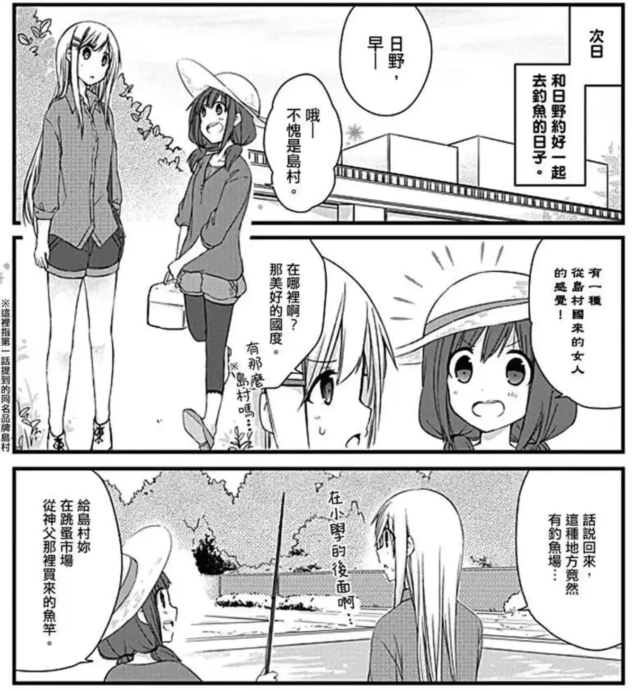

> 

[Google Map](https://maps.app.goo.gl/6G4NUoTdbMNCX21G7)

#小说 #动画 #まに漫画

#35.3882771, 136.8265854

### 37.1 那加新橋

和动画第4、10话中出现的桥非常相似，但从河流的形状和风景来看，可能是不同的桥。

> 
> 
> 

#动画

#35.4069858, 136.8436193

[Google Map](https://maps.app.goo.gl/btbh1SmUr9eW6z3X9)

#### 37.2 社妹漂流的地方

> 

（房子暂且不提，河边堤坝的样式就完全不一样，不懂巡礼册子为什么会认为是这里）

#动画

#35.4065047, 136.8437208

### 樽見鉄道

> 

樽见线是一条连结日本岐阜县大垣市的大垣站至岐阜县本巢市的樽见站，属于樽见铁道的铁路线。该线路仅有一条，全长34.5公里。

樽见名字就取自这条铁路，具体可参阅入间人间官方主页「入間の間」上发布的『2021年6月のにっき』。（网站现已关闭，可以在微博上看 [@滨名远江 的摘译](https://weibo.com/7289018178/KiExkCWej)）

樽见站虽然离市区很远，但旁边就有日本三大樱之一的[根尾谷淡墨桜](https://maps.app.goo.gl/bCmMwJhopqThYNoP9)，樱花季时可以一并看看。

#小说

#35.6353868, 136.6161715

[Google Map](https://maps.app.goo.gl/vmcM7uPyrz4bLmEd8)

## 愛知

### 1. 名古屋駅

安达与岛村购买情人节巧克力的地方。

> > 樽見轉身背對我，看往電車外面。這種狀態不斷持續，就在我開始胡思亂想，心想這輛電車能不能迴轉時，終於抵達了**名古屋**。
>
> 小说第三卷第三章「編織過去的荊棘，古典玫瑰」

> > 去**名古屋**，買巧克力，再跟她交換。順利進行這三個動作，就是今天的目的。
>
> 小说第四章「以及擁抱聖母的愛，金盞花」

> > 我們要去**名古屋**買巧克力。不知道明年會怎麼樣？我們明年就升上三年級了，有辦法去嗎？
>
> 小说第十卷「Cherry Blossoms for the Two of Us」

> 
> 
>
> （这张照片和动画相比少了固定站牌，3号站台的出口也不止这一个，照片拍的可能并不是正确位置）

#小说 #动画

#35.170915, 136.8815369

[Google Map](https://maps.app.goo.gl/gZvbwoJKG3q4aAr19)

### 2. 金時計

小说第三卷第三章「編織過去的荊棘，古典玫瑰」中，樽见提到的发生了杀人案的金时钟。

> > 妳還記得幾年前在這個時鐘這裡有發生殺人案嗎？

> 
> 

关于杀人案，详见入间人间的另一部作品《6天6人6把枪》

#小说 #动画

#35.1708547, 136.8829386

[Google Map](https://maps.app.goo.gl/pSZNg94VvaJqcpmb7)

### 3. 高島屋

安达与岛村购买情人节巧克力的地方。

> > 進到洋式點心賣場後，我開始煩惱該在哪裡買。結果我還是沒問安達到底喜歡什麼口味，不知道該以什麼標準來挑。稍做思考後，我決定跟著大排長龍的隊伍。
>
> 小说第三卷第三章「編織過去的荊棘，古典玫瑰」

> > 輪到我們時，只剩下一般的巧克力商品，一盒當中有許多口味，也沒有情人節時可能會看到的心型巧克力。我拿著這一盒巧克力，和島村一起前往地下街的角落。
>
> 小说第四章「以及擁抱聖母的愛，金盞花」

> 
> 

> 

> 
>
> 小说与动画中俩人交换的巧克力品牌不明，但在柚原もけ漫画中是歌帝梵（ゴディバ）巧克力。

现实中，高岛屋也确实会在每年情人节期间会举办日本最大的巧克力销售活动「Amour du Chocolat!（アムール・デュ・ショコラ）」。

#小说 #动画 #まに漫画 #柚原もけ漫画

#35.170914, 136.8831799

[Google Map](https://maps.app.goo.gl/zipZg6Jx79H6Dp9L7)

### 4. 電光掲示板

小说第三卷中岛村给安达留言的电子告示板。

> > 目前告示板沒有顯示任何畫面，一片漆黑，在那後方則有一大片紫色天空。
>
> 小说第三卷第三章「編織過去的荊棘，古典玫瑰」

> > 剛才一片漆黑的告示板上，顯示出「我最喜歡某某人了」、「愛你喲，啾～」等光看就覺得難為情的短文。情侶們看著那些如電車內新聞告示般不斷更替的文字，興奮地說著哪些是自己寫的。看來那是特別為情人節設計的活動。
>
> 小说第三卷第四章「以及擁抱聖母的愛，金盞花」

> 

小说中的电子告示板应该是 MCDecaux 公司在 2015 年制作投放的「行人信息牌（歩行者案内板）」，可以提供多语言电子地图、免费 WiFi 和紧急信息广播等功能，同时利用另一侧展示的广告所获得的收入进行维护。

> 旧告示板
>
> 

2022年该告示板被拆除更换为太阳能款，可在侧面使用 USB 接口为手机充电。

> 新告示板
>
> 

#小说 #まに漫画 #晚上巡礼

#35.170646499682505, 136.8841382061296

#### 4.1 電光掲示板 (桜通口)

动画和柚原もけ漫画的电子告示板。

> 

> 
> 

> 

就在名古屋駅桜通口出来的地图告示牌上方，不过实际现实中并不存在。

#动画 #柚原もけ漫画 #晚上巡礼

#35.17098976755827, 136.88342905203427

### 5. 飛翔

小说第三卷第四章「以及擁抱聖母的愛，金盞花」中提到的银色立体艺术品。

> > 島村帶我前往的，是車站外頭。一走到奇妙的銀色立體藝術品附近，就感受到夜風的吹拂。

> 

> 

站前标志物，高约二十三米，直径二十一米。内部可以进入。

※ 已于2022年被完全拆除

[Google Map](https://maps.app.goo.gl/Kmdte2MBZ37H9RrJ6)

#已拆除 #小说 #晚上巡礼

#35.1712954, 136.8842236

### 6. 星宮社

其中包含有「上知我麻社」和「下知我麻社」俩个境内社，社妹的名字就由来于此。

> 
> 
> 
> 
> 

星宫社本身则是《电波女与青春男》中出场的另一个外星人的名字由来。

#小说

#35.0883149, 136.9347129

[Google Map](https://maps.app.goo.gl/giZkfG7cab7rMAHw7)

### 7. 中部国際空港 セントレア

小说第八卷中，安达与岛村修学旅行和出国旅行时乘坐飞机的机场。

> > 就跟和安達聊到的一樣，我上一次到**機場**已經是高中那時候的事情了。
>
> 小说第八卷「遠遊」

> > 遊覽車已經在學校校舍前面等了。我們要搭這些遊覽車到車站，再轉乘一次，才能到**機場**。這裡不是能搭一班電車就到機場的方便地區。
>
> 小说第八卷「第一次旅行的一角①」

> > 「我們再去旅行吧。」
> >
> > 我回頭看著**機場**說道。我看見一旁的島村也回頭望向機場。
> >
> > 「等我們存夠錢就去吧。」
> >
> > 「嗯。」
>
> 小说第八卷「返家」

#小说

#34.8592566, 136.8163834

[Google Map](https://maps.app.goo.gl/UUtF6tDNEAsAFQhz8)

## 東京

### 1. 田無駅

站在二楼北口就能拍到和动画第2话10:08相同角度的照片。

> 
> 

#动画

#35.7273335, 139.5394451

[Google Map](https://maps.app.goo.gl/k3ChUhMdTgUhP5MF8)

### 2. ASTA 前

动画的车站外场景。

动画做了左右镜像处理。

> 
> 
> 
> 
> 
> 

<!--
动画 第9话 17:30
动画 第10话 20:27
动画 第12话 03:26
-->

实际小说中是发生在「[33. 岐阜駅](#33-岐阜駅)」外的。

#动画

#35.72776460356102, 139.54014045694822

### 3. 階段

动画中安达第一次牵上岛村手的楼梯

> 
> 

实际小说中应该是发生在「[33. 第一次牵手的阶梯](#33-第一次牵手的阶梯)」。

#动画

#35.72795186137943, 139.54002109864612

### 4. ベンチ

动画中安达常坐的长椅。

> 
> 
> 
> 

<!--
动画 第1话 19:21
动画 第2话 11:39
动画 第2话 11:50
动画 第6话 09:41
动画 第8话 21:43
动画 第12话 03:35
-->

实际小说中是坐在「[11.1 安达常坐的栏杆](11.1-安达常坐的栏杆)」。

#动画

#35.72835080862603, 139.5397433617889

### 5. 横断歩道

动画第1话中岛村回头看安达时的背景。

> 

（不过实际这里没有红绿灯，背景也不太像，应该是单纯根据角色行动推测出来的）

#动画

#35.72804792897685, 139.53953993034872

### 6. 横断歩道

动画第1话中，岛村和日野永藤一起走过的人行横道。

> 
> 

> 
>
> 在动画中，日野手里拿着美式热狗（アメリカンドッグ），永藤拿着肉包子（肉まん），岛村则是抱着一杯绿茶。应该都是在人行横道旁的7-11便利店里买的。

> 同时这里也是动画第2话中，安达与岛村第一次牵手走的斑马线。
>
> 

#动画

#35.72766771413104, 139.5394158509267

## その他全国のあだしま聖地

### Animate 岐阜

安达在「電撃文庫超感謝フェア2020」Animate特典短篇「掌心」中，决定成为有钱人买下所有岛村周边的 Animate 店。

> > 为了打发时间来到距离车站一分钟路程的**Animate**，结果迎面就看到了岛村的挂画。为什么？怎么回事？

> 

#小说

#35.4086404, 136.7580888

[Google Map](https://maps.app.goo.gl/uqDifvukRJQJLQko6)

### サンマートサカイ 東栄店

TV动画Blu-ray初回限定版特典「Chito」中岛村提到的超市。

> > 我家附近有一家叫**Sunmart**的超市，因为发音像，我小时候还以为那说的是秋刀鱼呢，明明袋子上都画着太阳了。

Sunmart 在岐阜县内有三个门店，从岛村家可能的大概位置来看，可能是①長良店或者②東栄店。

#小说

#35.41460562584767, 136.77530927850205

[Google Map](https://maps.app.goo.gl/yiF7oMKqB4RrSzs29)

### サンマートサカイ 長良店

TV动画Blu-ray初回限定版特典「Chito」中岛村提到的超市。

> > 我家附近有一家叫**Sunmart**的超市，因为发音像，我小时候还以为那说的是秋刀鱼呢，明明袋子上都画着太阳了。

Sunmart 在岐阜县内有三个门店，从岛村家可能的大概位置来看，可能是①長良店或者②東栄店。

#小说

#35.461370911920504, 136.77501710295294

[Google Map](https://maps.app.goo.gl/BWiggCfPGaPusCX4A)

### 鳥羽水族館

小说第八卷「第一次旅行的一角①」中岛村提到的鸟羽水族馆。

> > 我仰躺著打開書包。這讓我想起抱著貝殼的海獺布偶。我記得那是很久以前在**鳥羽水族館**買的，卻沒有擺在我房間。

> 

> 考虑到初中的岛村正处于叛逆期，这应该是岛村还被称为小岛时去的。

这家水族馆养殖种类数量全国第一，海牛、儒艮和海獭都很有名。

#小说

#34.4815825, 136.8456926

[Google Map](https://maps.app.goo.gl/3471tEzgsHcfNDea7)

### 伏見駅

小说第七卷「如果沒有在體育館二樓相遇」的if线中，社会人安达会在这个车站换乘。

> > 我搭乘電車到下一站，再次上下樓梯前去轉乘。明明走的距離也不是很遠，卻只是一直吐出更多嘆息。

#小说

#35.1692512, 136.8974207

[Google Map](https://maps.app.goo.gl/uwUY4CgfTusPi7ur8)

### サンフランシスコ

小说第八卷中安达与岛村都提到了有名的螃蟹招牌。这应该就是旧金山渔人码头的著名标志。

> > 稍微想一下之後，浮現腦海的是這個地方。我想去看很有名的**螃蟹招牌**。
>
> 小说第八卷「第一次旅行的一角①」

> > 或許要昨天就先去看有名的**螃蟹招牌**才對。
>
> 小说第八卷「返家」

> 

顺带一提，推测她们使用的机场是旧金山国际机场。

#小说

#37.8083411, -122.4157485

[Google Map](https://maps.app.goo.gl/JAh9BymHFcWVnbt7A)

### 九商フェリー(株) 島原港

小说第八卷「第一次旅行的一角①」中，安达与岛村在修学旅行中乘坐的邮轮。

> > 特地拉長前往下個目的地路程的郵輪之旅、同學們的喧鬧聲、沒有任何掩蔽物的大海、感覺很大的船（好像也沒有很大）的甲板、環繞四周的白色與藍色。

这是一艘在熊本县和长崎县之间往返的邮轮。

> > 其他同學把船員在上船後發的小點心，丟向群聚的海鷗。不曉得這些海鷗是不是養來做觀光用途，已經習慣餵食了，牠們都很精準地接住丟到空中的點心，沒有漏接。
>
> 实际确实可以像小说一样在船上喂食海鸥。
>
> 

#小说

#32.7671546, 130.3729698

[Google Map](https://maps.app.goo.gl/5jX985LWrUMWJPCR8)

### 水前寺成趣園

小说第八卷「第一次旅行的一角①」中修学旅行的目的地之一。

> > 下船經過一小段路後，就到了我也聽過名字的一座公園。雖然它的正式名稱不是公園，是個有神社、漂亮的流水景觀等許多必看之處的有名景點，但我們來這不是為了這些景點，只是要來吃午餐。

> > 午餐的餐點是蕎麥麵跟馬肉涮涮鍋。這是我第一次吃馬肉。今天有很多人生中的第一次，以旅行來說是很不錯的一段體驗。我用筷子夾起擺在盤上的肉，為肉的薄度感到驚豔。大概比一般的人情味還要淡薄。
>
> 现实中的二楼餐厅菜单上确实有荞麦面和马肉涮涮锅。

> 

#小说

#32.7909162, 130.7347899

[Google Map](https://maps.app.goo.gl/9g5LKkJYxLHUUwzZ9)

### 別府地獄めぐり

小说第八卷「第一次旅行的一角①」中修学旅行的目的地之一。

> > 在公園吃完午餐之後，我們真的幾乎沒有參觀景點就搭上遊覽車，開始一趟地獄巡禮。真的就叫這個名字。車子沒有停下來讓我們下車，而是以單純開車經過景點的方式參觀。途中有個地方有很多鱷魚，那裡最引起我的興趣。

> 其中的[鬼山地狱](https://maps.app.goo.gl/Kw5e9eX7akCrziW76)（又名鳄鱼地狱）引起了岛村的兴趣，那里养了大约80头包括鳄鱼、美洲短吻鳄等种类的鳄鱼。
>
> 

#小说

#33.3158833, 131.4696745

[Google Map](https://maps.app.goo.gl/ukfHxQYynsE2x75V9)

### 阿蘇山

小说第八卷「第一次旅行的一角②」中修学旅行里遭遇浓雾的地方。

> > 一走下停車場，就什麼都看不見了。正確來說不是什麼都看不見，是只看得見一整片白白的濃霧。這時候回過頭，就看到遊覽車的車身也已經被霧掩蓋。

> 

#小说

#32.885549, 131.0534824

[Google Map](https://maps.app.goo.gl/qbUcKAHmgM1tAGvP7)

### ハウステンボス

小说第八卷「第一次旅行的一角②」中修学旅行的目的地之一。

> > 遊覽車好像不是直接前往目的地，而是要先繞去別的地方。
> >
> > 「主題樂園好像是荷蘭風格的，說到荷蘭妳會想到什麼？」

> 

#小说

#33.0897198, 129.7918921

[Google Map](https://maps.app.goo.gl/HEoMFN95s73SF6Et5)

### 白鳥ループ橋

小说第六卷第一話「月曆的彼方」中，岛村一家人去外公外婆家时经过的桥。

> > 我們經過大角度的**螺旋狀橋梁**，又順著溪邊前行。當建築物變少，色彩單調的山間景色開始變多時，我們通過最後的小橋，這才終於抵達外公外婆的家。

[by 微博@甘井文](https://weibo.com/7651616302/O5kzdk7o0)

#小说

#35.8797769, 136.8536947

### 二の鳥居

小说第十一卷「Remember22」中，安达与岛村坐学姐的人力车经过的鸟居。

> > 「這裡是非常有名的鳥居～不管是情侶、新郎新娘，還是來遠足的小學生都會來走過一遍喔～直直走進去就可以看到神殿了～」
> >
> > 學姐像是把事前錄好的語音拿出來播放一樣，突然開始解說觀光景點。她示意的方向上有一座矗立在道路正中央的巨大鳥居。鳥居旁邊也有大型的狛犬雕像守著。而那裡似乎也真的就如學姐所說，是一個觀光景點，可以看到一群應該是跟著旅行團過來的女子一起在鳥居底下拍照。

> 

[Google Map](https://maps.app.goo.gl/WhkTLnY7pMRFLDUg9)

#小说

#35.3198683827718, 139.5526042588961

### 六地蔵

小说第十一卷「Remember22」中，安达与岛村坐学姐的人力车经过的六尊地藏菩萨。

> > 不久，人力車的大車輪旁邊就出現了一個應該是觀光景點的地方。
> >
> > 我們眼前有六座戴著紅帽與領巾的地藏菩薩。

> 

[Google Map](https://maps.app.goo.gl/XNtMHsD7NF6uBbw26)

#小说

#35.31538209415396, 139.54653753794292

### Sugakiya

在小说第四卷「以及擁抱聖母的愛，金盞花」中，安达与岛村在去名古屋的路上玩词语接龙时提到。

安达在接龙的最后把差点脱口而出的「好き（Suki）」改成了「スガキヤ（Sugakiya）」。

> > 「那是什麼？」
> >
> > 「……喜來登。」
> >
> > 「啊，原來妳吃螺絲了啊。」
> >
> > 島村乾脆地相信了我牽強的謊言。
> >
> > 謝謝你，喜來登。我以帶著血味的舌頭道謝。
>
> ※ 台版小说的本地化将「Sugakiya」一词换成了「喜来登」

> 

Sugakiya 是一家总部位于爱知县名古屋市的拉面连锁店，在与爱知县相邻的岐阜县同样分店众多。安岛巡礼路上的各个地方都能遇到：[モレラ岐阜](https://maps.app.goo.gl/BSAVwGV3VGjjfSUJA)、[岐阜駅前](https://maps.app.goo.gl/WaCRa1EFaNjk95gr9)、[イオンモール各務原](https://maps.app.goo.gl/nEodh4NWYcJzoDCZA)、[名古屋駅](https://maps.app.goo.gl/niGHRzuHqhwYp6DT6)等。此外，为安达配音的鬼头明里也是名古屋人，Sugakiya 是她非常喜欢的拉面店，连维基上都有写。

> 

叉勺合一的餐具是其特色，在《爱吃拉面的小泉同学》漫画19话、动画第十二话中也有出场，小泉同学会先用筷子吃掉一半，再把蛋黄戳开换拉面叉子吃面，这样就能同时吃到面和融合了蛋黄的汤。

[by 微博@滨名远江](https://weibo.com/7289018178/JwVmpqKvi)

#小说 #动画

## 巡礼建议

> **交通**
>
> 大部分巡礼点都位于岐阜本巢市内，市区内道路平坦，非常适合骑车巡礼，在自行车的帮助下只花一天时间就足以巡礼完本巢市的巡礼点。
>
> 推荐使用「[Gifu-ride](https://interstreet.jp/gifushi/)」共享单车，在「[28. 石金温泉旅馆](#28-長良川観光ホテル石金)」楼下就有自行车点位，并且是电动助力车，骑起来完全不费力，只要有80%的电量就足以来回骑上一天。骑上去以后记得要打开电源才会出力，有パワー(HIGH)、オート(AUTO)、ロング(ECO)三种模式，短距离无脑选パワー(HIGH)就好，骑一天的话建议オート(AUTO)。
>
> 不过 Gifu-ride 不像 LUUP 标配手机支架，为了避免在骑车过程中频繁停车看手机确认导航路线，建议自带一个手机支架或透明腕包。

> **行程**
>
> 如果是早上9点从石金出发的话，差不多中午12点就能到达「[15. 岐阜農林高等学校](#15-岐阜県立-岐阜農林高等学校)」，推荐学校旁边的「[桜ラーメン 北方店](https://maps.app.goo.gl/qSvFxvLkuK3A8jRK6)」。拉面味道很不错分量也很大，招牌猪肉很香，推荐搭配香油食用。这家店是先到座位上点餐，吃完以后再把账单拿到收银台结账。因为不是餐券制，所以日语不好的话最好提前想好要点哪份记在手机上给服务员看。
>
> 之后下午三点半就能到达 MALera 了，晚餐可以直接在其中的美食广场里解决。黄昏时可以再去旁边的「[7. 鞍掛神社](#7-鞍掛神社)」拍夕阳下的神社，再等夜幕降临后就可以去拍「[3. 見延公園](#3-見延公園)」的夜景了。
>
> 最后直接骑车回去就好了，本巢非常乡间，很多地方都没有路灯，夜间骑行需要格外注意安全。
