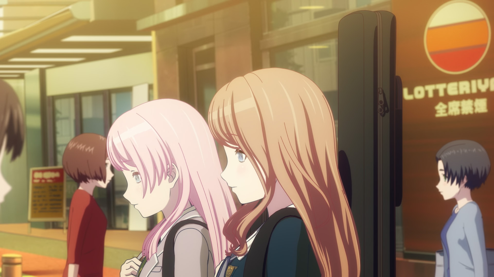
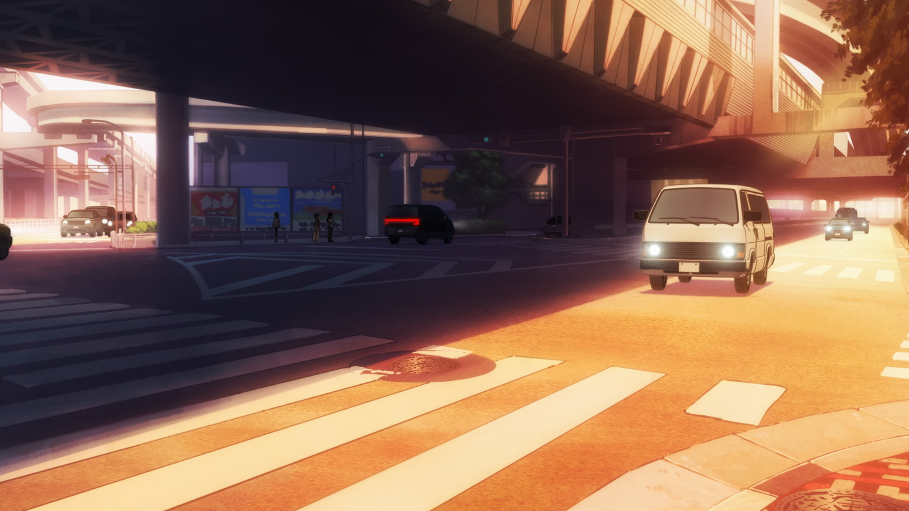
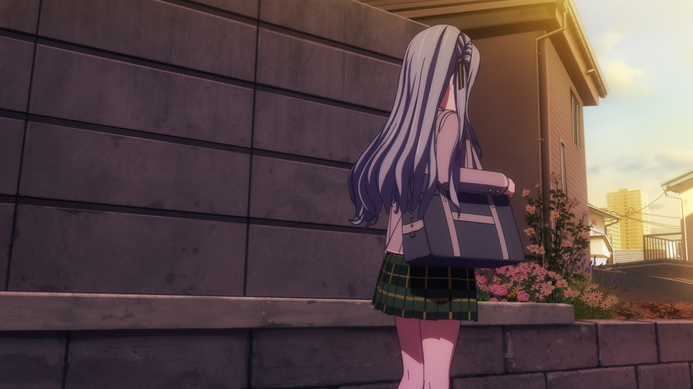
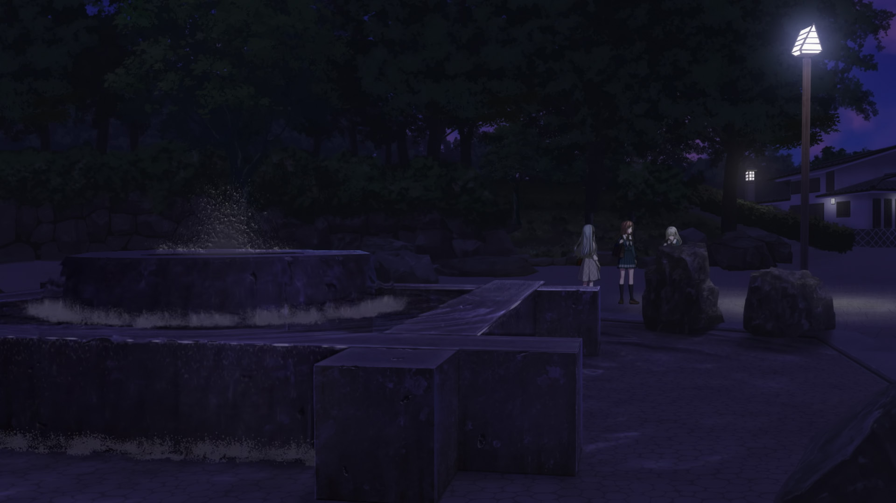
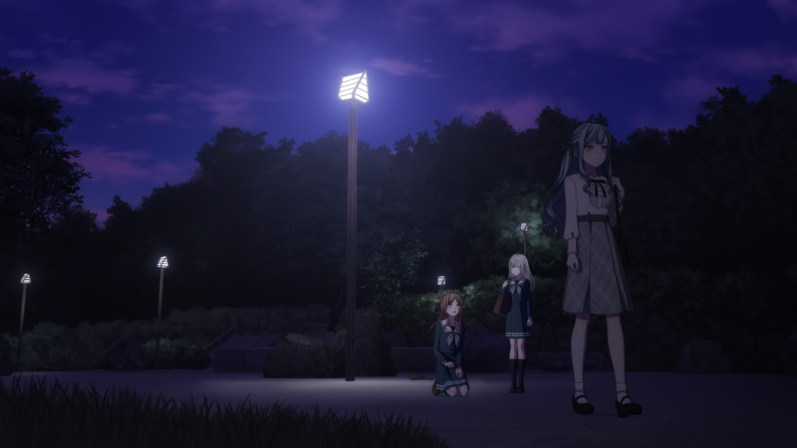
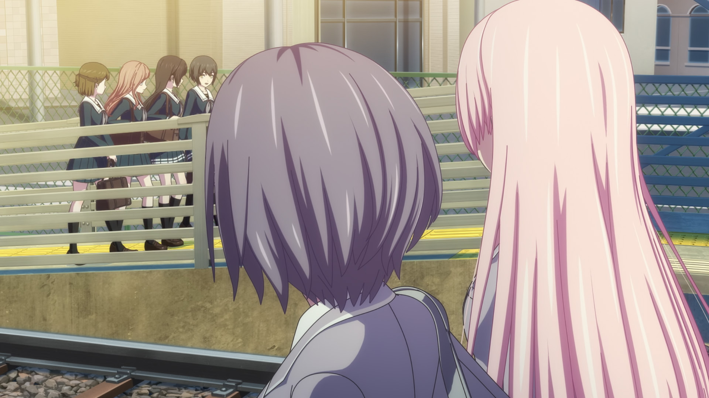
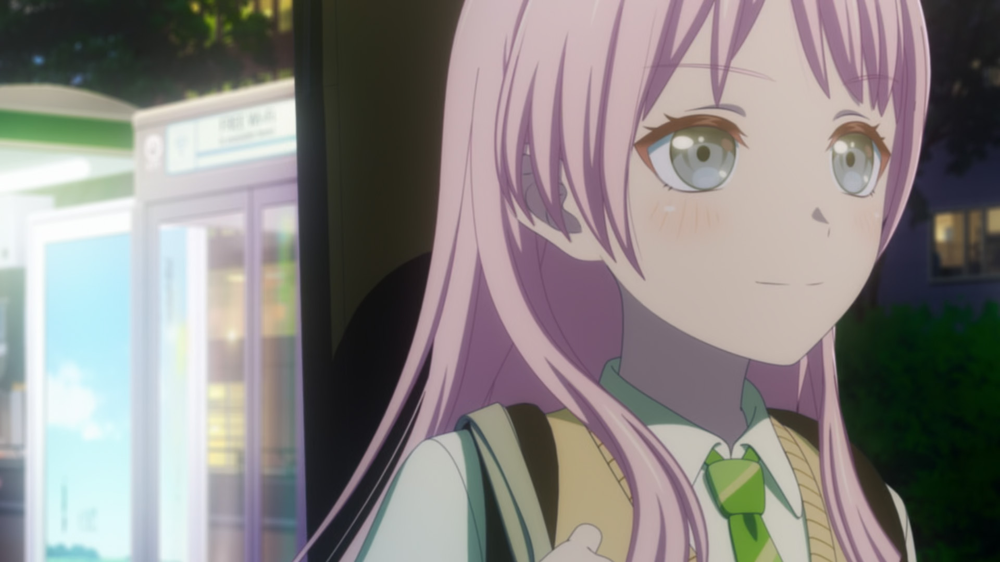
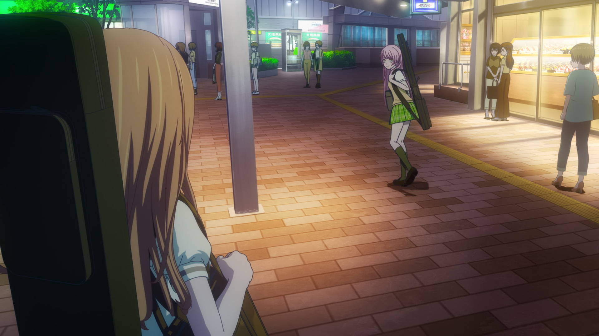

---
tagColors:
  default: E60050
  MyGO: 3387bb
  已拆除: 757575
mapCenter: 35.720801,139.724038,15
baseUrl: https://fastly.jsdelivr.net/gh/hymbz/MarkdownMap@BanG-Dream
---

# mygo 巡礼

> repo: 早上因为低估了洗漱和早餐时间，导致行程晚了一个多小时才出发，好在预留的时间还算充足影响不大。

## 池袋 上午

> repo: 虽然在去之前就听说了池袋站里很容易迷路，但想说车站里肯定会有指示牌和地图吧就没在意，结果真就求锤得锤。找半天没找到地图，想从东出口出去，结果能找到的指示牌都是西出口的，最后选择了从西出口出去再过马路回来。

### 食と緑の空中庭園

第8话里祥子与初华约会的地点。

> 
> 
> 
> 
> 

> 

> repo: 因为天气不好所以我本已经放低了心理期待，但还是被光秃秃的藤蔓给搞得心态半崩，和动画中的郁郁葱葱相比反差未免太大了

[Google Map](https://maps.app.goo.gl/w1wuqCnY2YPqUdnM7)

#MyGO

#35.72982986673469, 139.71191452423238

### 爱素、海睦等红绿灯的路口

> 
> 
> 

> 

看斑马线的宽度就能知道这里人流量有多大了，除非凌晨半夜来不然不可能避开人流。

> repo: 人流量真不是一般的大，根本拍不了照

#MyGO

#35.72958908825601, 139.7141424442111

### Mixalive TOKYO

RiNG 的原型大楼。

四楼有一家与武士道合作的「[GAMERS](https://maps.app.goo.gl/s8v6ypcnxkTWo2WGA)」，巡礼时可以顺便买谷。

> 
> 
> 

> 因为建筑物更相似的缘故，可能会将旁边的优衣库错认为 RiNG 的原型，但官方明确说过就是这里

> repo: 去的时候外面拍完照就走了，回来才知道里面有合作G店，血亏。早知道就能在这里买周边了，之后去秋叶原都没找到好看的 mygo 周边

[Google Map](https://maps.app.goo.gl/NqciMNVSNTnxUXsC6)

#MyGO

#35.729773175555046, 139.71478276925774

### TV放送告知＆1st LIVE 视觉图

> 
> 
> 

#MyGO

#35.730252, 139.7166244

### 逃走的灯1

第1话里灯重力发言后从爱希身边逃走时路过此地。

> 
> 

#MyGO

#35.7294264, 139.7167086

### 逃走的灯2

第1话里灯重力发言后从爱希身边逃走时路过此地。

> 
> 
> 
> 

#MyGO

#35.729045, 139.717099

### 13话街景镜头

第13话里爱音为了安慰被「祝你幸福」的灯而去杂货店的前一个镜头的场景。

> 
> 

> 

#MyGO

#35.729231, 139.7171644

### 東池袋中央公園

爱音撞见初中同学的公园。

> 
> 
> 
> 

> 

> repo: 这边人意外的少，旁边就是阳光城还以为会有很多游客呢

[Google Map](https://maps.app.goo.gl/vSd59V6pTEdoRbYK7)

#MyGO

#35.7301211, 139.7186188

### 陽光水族館

爱灯定情圣地。

> 
> 
> 
> 
> 
> 
> 
> 

> 
> 
> 

> 
> 
> 

爱灯所在的是位于顶楼的「天空企鹅」前，人气很高驻足的观众非常多，因此比较难拍照。

如果希望拍出第5话的夕阳和夜幕的氛围，请务必提前上官网确认好「[营业时间](https://sunshinecity.jp/zh-tw/aquarium/ticket/calendar.html)」，在九月至三月的冬季里，水族馆只会营业到下午六点。水族馆出去后就不能再进来了，不过顶楼有很多位置可以坐，也有咖啡馆可以填肚子，可以在里面慢慢等夕阳和夜幕降临。

门口有支持中文的自动售票机，但好像只会在人多时开放使用。

> repo: 回来以后才发现我去的那天刚好是冬季营业的最后一天，只要和第二天的行程互换下，就能拍到夕阳和夜幕了。
>
> 馆内氛围确实很好，除了情侣外大部分都是家长带孩子来看的，也碰见了不少中国游客。

[官网](https://sunshinecity.jp)

[Google Map](https://maps.app.goo.gl/X7MVY32Q57HqmxBm9)

#MyGO

#35.72933065223056, 139.72031220685375

### サウンドスタジオノア

CRYCHIC 使用的录音室。

> repo: 本来是打算来这附近的餐厅吃饭完顺带巡礼的，结果准备导航过来时才发现居然没有营业？只能放弃这个著名圣地。
>
> 说回这家餐厅，它还不是临时有事的休业，是每周固定放假一天，我还是头一次见有餐饮业这么玩的。不过也提醒到我了，晚上回酒店检查了一波计划，提前避险了后面同样的另一家。

[Google Map](https://maps.app.goo.gl/h9cmUKs75DmNxnedA)

#MyGO

#35.733998611554284, 139.7167247981278

### 千登世小橋

灯与祥子在这里初次相遇。

> 
> 
> 
> 
> 
> 
> 
> 
> 

> repo: 唉，季节。巡礼还是得夏季才合适，这光秃秃的藤蔓，又刚好赶上铁路维修，春日气氛是一点没有

[Google Map](https://maps.app.goo.gl/RLoAEAPpWL9yuw4VA)

#MyGO

#35.7187602, 139.7137742

## 早稲田

### ED 素世

> 
> 

[Google Map](https://maps.app.goo.gl/7z9bYm7h1F37WSVQ7)

#MyGO

#35.7165936, 139.7177494

### 富士見坂

邦邦动画里出场多次的斜坡。

> repo: 因为想亲自走一趟这个斜坡，所以我骑车巡礼到这后，就先在这附近的点位直接还车了。

[Google Map](https://maps.app.goo.gl/z6gMvENxqdSNmDvA6)

#MyGO

#35.71659153537404, 139.71769231267348

#### 祥子

祥子放学回家时会走这条路。

> 
> 
> 
> 
> 
> 
> 
> 

> 
> 

> repo: 虽然提前看过了照片，但实地亲眼看到并走一遍后还是挺震撼的，这坡也太陡太长了吧，难以想象灯和祥子居然要每天走这条路上学。

#MyGO

#35.71666122252455, 139.71773254580876

#### 灯

第10话里灯走这条路上学。

> 
> 
> 

> repo: 走完斜坡后准备重新骑上 LUUP，结果走到了点位才发现居然只有滑板车，手机查了一圈周围的其他点位也都只剩下滑板车了。因为从来没骑过滑板车不敢尝试，就索性直接步行完成了剩余巡礼。

#MyGO

#35.71573950244384, 139.71705982207294

### 立希家

> 
> 
> 

#MyGO

#35.7134862, 139.7143653

### 面影橋

立希家楼下的桥。

> 
> 
> 
> 
> 
> 

#MyGO

#35.7131929, 139.7142422

### 早稲田駅（都電）

在邦邦动画中出场多次的车站。

> 

> 

#MyGO

#35.71179355586158, 139.7191875702592

### 神田川桜並木

香澄发现有咲星星贴纸的地方。

> 
> 
> 
> 
> 

在2016年整修后，原有的绿色护栏变成了黑色立竿，墙边也增加了绿化和道路告示板。

> repo: 非常意外的居然在这里被一个日本老太太问路了，用N114514日语表明我不会日语后她还自己去看附近的地图告诉我找到了目的地让我安心，非常温柔。

#第一季

#35.71259185918345, 139.7221178798909

### 駒塚橋

> 
> 
> 

> 
> 

[Google Map](https://maps.app.goo.gl/r2U5SteBg5gHQVjt5)

> repo: 本来一路走到这里已经很累了，但在看到那标志性的白绿色护栏后，激动的心情直接将疲劳一扫而空，腰不酸了腿不累了，浑身都是劲。

#第一季

#35.71210315327328, 139.723313841284

### 胸突坂

有咲上下学路上的坡道。

> 
> 

> 
> 
> 

> 

> repo: 之前看其他人说这坡挺陡的不好爬还做好了心理准备，但实际爬了下感觉还是挺轻松的，我这个平时完全不运动的死宅也能轻松爬完。完全没感觉到疲劳，只有亲身漫步在 ksar 圣地里的死而无憾的幸福感。

[Google Map](https://maps.app.goo.gl/1LntnKpxi7mDc66g8)

#第一季 #第二季

#35.712602417842064, 139.72353362286768

### 永青文庫

有咲家仓库的原型。

> 

> 
> 

仓库就在进门左手边，不进去也能拍到。

如果打算进去参观的话要注意他们的闭馆时间很早，下午四点截止入场，四点半就闭馆关门了，时不时还会直接休馆上一两周。

> repo: 我到的时候刚好就是四点半，之前没查过都不知道这么早关门，极限压线赶到刚好碰上了关门的工作人员，非常温柔的等我进去逛完一圈拍完照才关门。
>
> 然而也是因为没提前查好，居然完全没发现仓库就在门口，进去逛了一圈没找到带着问号就离开了。之后重新回来路过才发现仓库就在门口，只能隔着门拍了一张。

[官网](https://www.eiseibunko.com)

#第一季

[Google Map](https://maps.app.goo.gl/2dxhycRPN8oC2cB36)

#35.712926, 139.723579

### 目白台三丁目交差点

香澄沿路寻找有咲星星贴纸时经过的地点之一。

> 
> 

> repo: 本来这边两个点我是要放弃的，因为距离太远原计划是要骑车来的，但逛完永青文庫后依然感觉不到一丝累，就又走过来了

#第一季

#35.715103, 139.724539

### 文京目白台一郵便局

香澄沿路寻找有咲星星贴纸时经过的地点之一。

> 
> 

#第一季

[Google Map](https://maps.app.goo.gl/qUXWLE292QdroSv16)

#35.715046, 139.724688

### 江戸川公園

Popipa 圣地。

[Google Map](https://maps.app.goo.gl/hYP8ccA5U28AuMfr8)

#第一季

#35.71059113860075, 139.72823804199015

#### ダブル滑り台

> repo: 最为著名的 Popipa 圣地，期待了半天，结果刚好赶上了设施维修，真是命途多舛的巡礼

[Google Map](https://maps.app.goo.gl/ZBnLFFdCGVuHf7Hf6)

#第一季

#35.71068515320478, 139.72637649584522

#### 時計塔

> 
> 

> 
> 
> 

[Google Map](https://maps.app.goo.gl/tY3qPfLf95fP7wBk9)

#第一季 #MV

#35.71046814264788, 139.72840186074632

### ED 神田川

> 
> 

#MyGO

#35.7104412, 139.7292113

### 地藏通商店街

> repo: 因为跳过了不少巡礼点的缘故，逛完江户川公园后时间比预计的还早得多，计划要去吃的餐厅甚至都还没开店。所以索性提前去旁边的地藏通商店街巡礼逛逛了。
>
> 不过这边也没太多能巡礼的，在偶遇的一家炸肉店买了抓肉饼吃。也找到了有里美丽玩偶的面包店，不过貌似是因为面包都卖光了提前关门，几个像是家庭主妇的人就直接在门口一直聊天，所以也没法拍照。

## 飛鳥山

### 飛鳥山公園

在邦邦动画中出场多次的公园。

> repo: 导航时想当然以为来飞鸟山公园肯定会导航到飞鸟山站吧就没注意看，结果上了车后才发现导航到了另一边的王子站，绕了一圈后才终于从公园后面的楼梯爬进了公园。

[Google Map](https://maps.app.goo.gl/xBZ6YNZDFPgM7DAW6)

#MyGO

#35.75065915987803, 139.73884043049452

#### 大象滑梯

第二季中香澄和多惠谈话前出现的镜头之一。

> 
> 

> repo: 不知道为啥，这附近聚集了好几堆年轻人，也不坐就站着干聊，声音还都很大，大晚上的像是混混聚会一样有点哈人

[Google Map](https://maps.app.goo.gl/xdcEQT2dWTxuFbni9)

#35.750432790405156, 139.73919440110254

#### 儿童城堡

第二季中香澄和多惠谈话的地方。

> 
> 

> repo: 因为被人占了正面楼梯，等了好一会也没见要走，只能拍下背面了

#35.750341740687695, 139.73892556468167

#### 井形喷泉广场

祥子向素世发出最后通牒的地方。

> 
> 
> 
> 

> 
> 
> 
> 
> 
> 
> 
> 

#MyGO

#35.750648907992115, 139.73818435313237

### 飛鳥山駅

[Google Map](https://maps.app.goo.gl/QUUVryi5gFZD6Tqx9)

#MyGO

#35.750246984161215, 139.7373609609084

#### 站牌

> 
> 

#MyGO

#35.7502333113434, 139.73738439202953

#### 街景

> 
> 

#MyGO

#35.75038786432471, 139.73760835648167

## 鬼子母神前

### 鬼子母神前駅

离月之森和灯家最近的车站。

> 

> 

[Google Map](https://maps.app.goo.gl/4yGPX4dV7Sk6DGLZ8)

#MyGO

#35.720058485297145, 139.7146738367045

#### 道口

> 
> 
> 

#MyGO

#35.7201708, 139.7148758

#### 三ノ輪方向的站台

> 
> 
> 
> 

#MyGO

#35.7200587, 139.714685

#### 早稲田方向的站台

> 
> 

> 
> 
> 

#MyGO

#35.7201232, 139.7147461

### 千登世橋人行道

第4话立希送灯回家时经过的人行道。

> 
> 

> repo: 立希不会是为了能多和灯走一段路才特意绕远到这里的吧（

#MyGO

#35.71928052375028, 139.71331520306143

### 成为人类桥

灯家楼下的天桥。

祥子在这里向池袋方向喊出了想要成为人类。实际在现实里是做不到的，因为池袋方向的护栏被加高了。

> 
> 
> 
> 

> repo: 动画看着挺宽敞的，实际感觉两人并肩都走不下

#MyGO

#35.7208335, 139.7128401

#### 爱音探头

第8话里爱音不知道灯家在旁边直接走上了天桥打算去乘车。

> 
> 

#MyGO

#35.7207248, 139.7127781

### 灯家

> 
> 

动画将位置移动到了离天桥更近的位置。楼下的「うずらやま薬局」也改名为了「やまうずら薬局」。

> repo: 去之前忘记存灯家截图了，随便拍了几个回来一看全错（

#MyGO

#35.721197, 139.7126134

## 池袋 晚上

### 池袋駅34番口

祥子前往音乐室退队时路过。

> 
> 

#MyGO

#35.730188390179556, 139.71298999426605

#### RiNG前的店面

> 
> 
> 
>
> 第4话爱素灯希四人分开时，爱素的背景

#MyGO

#35.7297055, 139.714683

### Sunshine City スペイン階段

> 
> 

> 谷歌的卫星地图里，台阶会被旁边的 Sunshine 60 大楼挡住很大一部分，可以改用在线版的谷歌地球来看

#MyGO

#35.72983763302039, 139.71844981960749

#### Sunshine 60

スペイン階旁边的高楼。

> 
> 
> 

[Google Map](https://maps.app.goo.gl/o8dqARUB3fcLxJ8B6)

#MyGO

#35.72940697293881, 139.718154800525

#### Subway

CRYCHIC 和 MyGO 常用的室外谈话场所。

> 
> 
> 
> 

> 

[Google Map](https://maps.app.goo.gl/R3PymeiuPt5bu9Ld7)

#MyGO

#35.7297968, 139.7180881

#### 三层台阶左下

第2话素世借爱音之名约来灯谈话时三人所坐的位置。

> 
> 
> 
> 
> 
> 
> 
> 
> 

#MyGO

#35.7298360, 139.7185960

#### 三层台阶右上

第10话初华帮忙扶住灯后两人交谈的地方。

> 
> 
> 
> 

#MyGO

#35.7297388, 139.7185790

### 7話 忘记一切的街道

> 
> 

> repo: 虽然人多，但都是一波一波的，抓住机会就能拍到照了

#MyGO

#35.7300249, 139.7158852

### 池袋駅35番口

「soyorin 也不要退出哦~」

> 
> 
> 
> 
> 
> 
> 
> 

这里的人流量非常大，如果打算在这里多拍几张的话，务必选择第二天是工作日的晚上来拍，并留足拍照时间。

> repo: 作为爱素最重要也是值得巡礼的点，期待了很久，也已经预计到了人会很多，但实际还是超乎了想象。特意将这个点放到了最后都已经快十点了，人流还是不见断过，等半天才找到机会拍了一张，其余只能含泪放弃了。

#MyGO

#35.729853885328815, 139.71317122674293

### 最后

> repo: mygo 巡礼遗憾还是比较多的，尤其是爱素的几个点。十话爱音追素世的车站、扶梯、素世家因为时间问题都没能去，最后最期待的 soyorin 车站口也没能多拍几张照。好在我更期待的 ksar 圣地胸突坂没出大问题，除去有咲仓库只能在门外拍外，唯一的遗憾就是当时太激动了导致忘了多拍几张照，只在上面往下拍了一张全景😂
